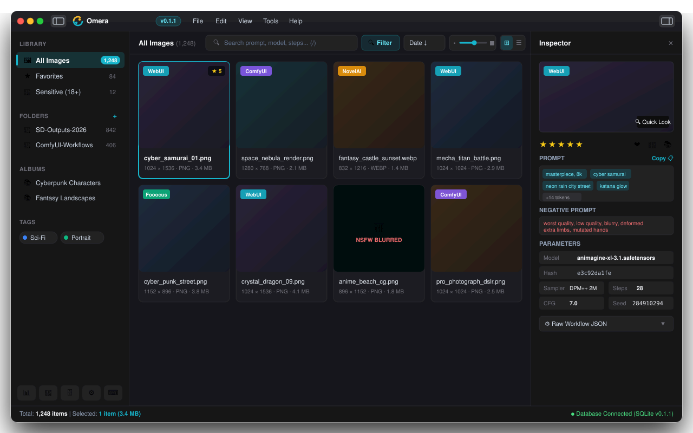

# 🍇 Berry AI Studio

<div align="center">

**[English](README.md)** | **[简体中文](README.zh-CN.md)** | **[繁體中文](README.zh-TW.md)** | **[日本語](README.ja.md)**

[](https://berryuiki.github.io/Berry-AI-Studio/)
[](https://github.com/BerryUIKI/Berry-AI-Studio/releases/tag/v0.2.0)
[](LICENSE)
[](https://tauri.app)
[](https://www.rust-lang.org)
[](https://vuejs.org)
[](https://github.com/BerryUIKI/Berry-AI-Studio/releases)

*專為 AI 圖像創作者與 Prompt 工程師打造的高效能、本機化 AIGC 元數據索引與資產管理工作台。*

<br/>

<picture>
  <source media="(prefers-color-scheme: dark)" srcset="docs/screenshots/gui_preview_dark.svg">
  <source media="(prefers-color-scheme: light)" srcset="docs/screenshots/gui_preview_light.svg">
  
</picture>

</div>

---

## 🌟 專案概述

**Berry AI Studio** 是一款專為數位藝術家、AI 繪圖創作者和提示詞工程師設計的桌面級圖像資產管理系統。本軟體能夠毫秒級掃描並深度解析主流平台生成的圖片元數據（提示詞、模型、取樣器、步數、CFG、Seed 及工作流 JSON），並建立本機高速 SQLite 索引，提供 **沉浸式三欄現代工作台**、流暢的虛擬網格瀑布流、分詞高亮屬性面板、沉浸式全螢幕燈箱以及豐富的批次分類能力。

> 🚀 **v0.2.0 版本發佈**：全新支援本機 CLIP 語意搜尋、AI 智慧標註、LoRA 觸發詞庫、多模式收割管道、智慧連拍堆疊與虛擬捲動瀑布流。

---

## ✨ 核心特色

### 🎨 沉浸式三欄創作工作台
- **原生質感無邊框視窗**：自訂標題列整合桌面選單列（`檔案`、`編輯`、`檢視`、`工具`、`說明`）、視窗拖曳區與精緻控制按鈕。
- **左側分類導覽列**：媒體庫快捷入口（全部圖片、我的最愛、敏感內容 18+）、資料夾階層目錄樹（支援即時掃描狀態回饋）、彩色標籤庫與智慧相簿。
- **中央畫廊、虛擬網格與瀑布流**：支援順暢渲染萬級圖像的虛擬捲動網格、Masonry 瀑布流版型、縮圖自由縮放滑桿（130px–360px），以及網格（⊞）/ 瀑布流（▦）/ 清單（☰）一鍵切換。
- **右側屬性檢查器**：大圖預覽卡片、`0~5` 星級評分、收藏切換、正反向提示詞分詞高亮與一鍵複製、辨識 LoRA 標籤、生成參數展台及原始 JSON 工作流折疊檢視器。
- **全螢幕沉浸燈箱 (Quick Look)**：按空白鍵（`Space`）或 Enter 即刻呼出，支援滾輪平滑縮放、拖曳平移、鍵盤方向鍵快速切圖。

### 🔍 全平台 AIGC 元數據無損解析
自動提取並索引正向提示詞、負向提示詞、模型名稱、模型雜湊、取樣器、步数、CFG、Seed、解析度與完整工作流：
- **WebUI (AUTOMATIC1111 / SD.Next)**：PNG `parameters` 區塊、WebP EXIF。
- **ComfyUI**：完整 Prompt 與 Workflow 工作流程 JSON 語法樹解析與 LoRA 載入器辨識。
- **NovelAI**：Comment 與 Description 簽名格式解析。
- **Fooocus / Fooocus-MRE**：專有參數與基底模型提取。
- **InvokeAI & EasyDiffusion**：內嵌元數據與 JSON Sidecar 伴生檔案。
- **支援檔案格式**：PNG、JPG/JPEG、WebP、MP4 影片及 `.txt` 伴生文字檔。

### 🗃️ 多模式匯入與智慧連拍堆疊
- **多模式資料夾**：外鏈模式（就地引用零拷貝）、託管保險庫模式（應用管理儲存）與 AIGC 管線模式（自動監控 WebUI/ComfyUI 輸出目錄並防抖收割）。
- **智慧連拍堆疊**：根據提示詞相似度與生成時間窗口自動聚合相近連拍版本。
- **互動疊放卡片**：撲克牌視覺疊放卡片，支援數量徽章、行內點擊展開/折疊、設定封面圖（`Alt+S`）、雙圖並排對比（`C`）與安全確認合併展開。

### 🧠 模型、提示詞與 AI 智慧
- **本機 CLIP 語意搜尋**：基於本機 ONNX CLIP/SigLIP 模型，直接在搜尋列輸入自然語言搜尋圖像。
- **AI 智慧標註與以圖搜圖**：內建 WD14 / Danbooru 動漫反推打標，支援多維度圖像視覺相似度檢索。
- **LoRA 觸發詞庫**：一鍵掃描 LoRA 模型目錄、比對 Civitai 元數據，並支援將觸發詞一鍵複製注入提示詞。
- **提示詞詞頻統計**：統計正反向提示詞中高頻詞彙並關聯平均評分表現。
- **模型庫管理與雜湊反查**：Civitai SHA256 快取自動同步、模型雜湊反查與一鍵反向篩選。
- **資料庫維護工具**：內建 SQLite VACUUM 空間壓縮、資料庫完整備份匯出與一鍵還原。

### 🌐 國際化與檢查更新
- **7 國語言原生支援**：繁體中文、簡體中文、English、日本語、Deutsch、Français、Español。
- **跟隨系統語言（Auto）**：預設自動符合目前作業系統語言。
- **GitHub Releases 線上檢查更新**：在 **說明 > 檢查更新...** 中一鍵取得最新版本、更新日誌與官方安裝檔。

---

## ⌨️ 常用快速鍵

| 快速鍵 | 功能說明 | 快速鍵 | 功能說明 |
| :--- | :--- | :--- | :--- |
| `Space` / `Enter` | 開啟 / 關閉全螢幕燈箱預覽 | `0` ~ `5` | 設定星級評分 (0 為清除) |
| `F` | 切換我的最愛 | `B` | 顯示 / 隱藏左側導覽列 |
| `I` | 顯示 / 隱藏右側屬性檢查器 | `/` 或 `Ctrl+F` | 聚焦頂部搜尋列 |
| `Ctrl+A` | 全選目前檢視全部圖像 | `Esc` | 取消選取 / 關閉彈跳視窗或燈箱 |
| `Ctrl+O` | 資料夾模式引導精靈 | `Ctrl+,` | 開啟偏好設定與設定 |
| `Ctrl+G` | 手動疊放 / 合併成堆 | `Ctrl+Shift+G` | 解除疊放 / 展開全部圖像 |
| `Alt+S` | 設定目前圖像為疊放封面 | `C` | 進入多圖並排對比模式 |
| `Delete` | 將選取圖片移至資源回收筒 | `?` | 呼出快速鍵手冊 |

---

## 📦 發行版安裝檔命名規範

GitHub Releases 官方發布的預編譯二進位檔案遵循標準命名格式：

$$\text{<應用名>}\_\text{<作業系統>}\_\text{<系統架構>}.\text{<檔案後綴>}$$

| 作業系統平台 | 處理器架構 | 格式類型 | 安裝檔檔案名稱 |
| :--- | :--- | :--- | :--- |
| **Windows** | x86_64 (64位元) | NSIS 安裝檔 | `Berry-AI-Studio_Windows_x64.exe` |
| **Windows** | x86_64 (64位元) | 免安裝免裝版 | `Berry-AI-Studio_Windows_x64.zip` |
| **macOS** | Apple Silicon (ARM64) | DMG 磁碟映像 | `Berry-AI-Studio_macOS_aarch64.dmg` |
| **macOS** | Intel (x86_64) | DMG 磁碟映像 | `Berry-AI-Studio_macOS_x64.dmg` |
| **Linux** | x86_64 (64位元) | AppImage | `Berry-AI-Studio_Linux_x64.AppImage` |
| **Linux** | x86_64 (64位元) | DEB 套件 | `Berry-AI-Studio_Linux_x64.deb` |

---

## 🛠️ 原始碼建置指南

### 環境準備
1. **Node.js** (v18+) 與 **pnpm** (`npm install -g pnpm`)
2. **Rust** (1.75+): 推薦透過 [rustup.rs](https://rustup.rs/) 安裝
3. **C++ 編譯環境**: Windows 為 MSVC Build Tools，macOS 為 Xcode CLI，Linux 為 `libwebkit2gtk-4.1`。

### 建置步驟
```bash
# 1. 複製程式庫
git clone https://github.com/BerryUIKI/Berry-AI-Studio.git
cd Berry-AI-Studio

# 2. 安裝前端相依套件
pnpm install

# 3. 執行本機開發熱重載模式
pnpm run tauri dev

# 4. 打包正式版安裝檔
pnpm run tauri build
```

打包產物位於 `src-tauri/target/release/bundle/` 目錄中。

---

## 📄 開源授權

本專案基於 **AGPL-3.0 開源協議** 發布。詳見 [LICENSE](LICENSE) 檔案。
