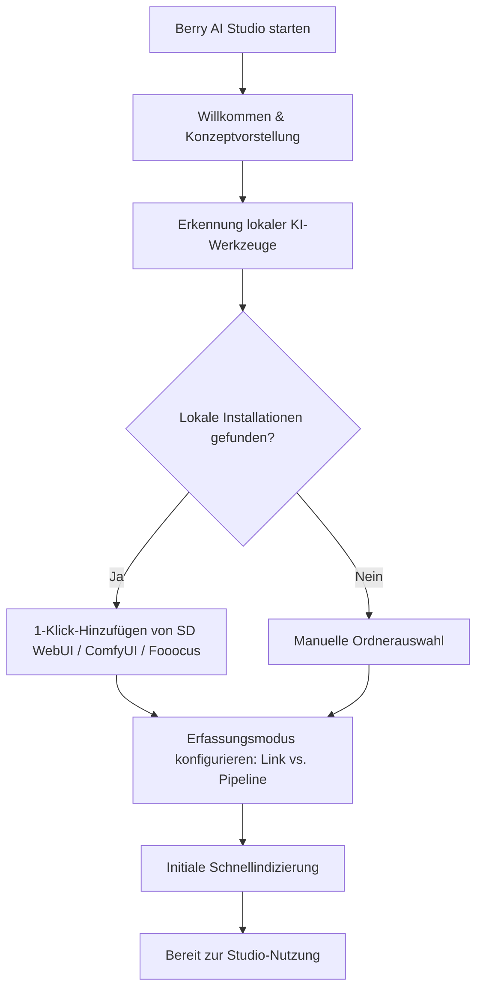

# Installation & Erster Start

Dieser Leitfaden beschreibt die Systemanforderungen, unterstützten Plattformen, Installationsschritte und die Ersteinrichtung über den Onboarding-Assistenten für **Berry AI Studio**.

---

## 1. Systemanforderungen

Berry AI Studio nutzt eine hocheffiziente native Architektur auf Basis von **Tauri v2**, **Rust** und **SQLite WAL**. Die Anwendung läuft reibungslos auf Standard-Hardware und schöpft auf leistungsstarken Multi-Core-Workstations mit NVMe-Speicher das volle Potenzial für umfangreiche Bibliotheken (50.000 bis über 500.000 Dateien) aus.

### Minimale Hardwareanforderungen
- **CPU**: Dual-Core x86_64- oder ARM64-Prozessor (Intel Core i3 / AMD Ryzen 3 / Apple M1 oder neuer).
- **RAM**: 4 GB RAM (8 GB+ empfohlen für die Ausführung lokaler CLIP/WD14-ONNX-Modelle).
- **Speicherplatz**: ca. 150 MB für die Anwendungsinstallation; zusätzlicher Speicherplatz für Vorschaubilder (konfigurierbarer 2-GB-Standard-LRU-Cache) und Mediendateien.
- **Bildschirmauflösung**: Mindestens 1280 × 800 Bildpunkte (responsiv herab bis 960 × 640).

### Unterstützte Betriebssysteme
| Betriebssystem | Unterstützte Versionen | Architektur | Pakettypen |
| :--- | :--- | :--- | :--- |
| **Windows** | Windows 10 (1809+) & Windows 11 | `x86_64` (64-Bit) | Standard-Installer (`.exe`), Portabel (`.zip`) |
| **macOS** | macOS 12 (Monterey) oder neuer | `aarch64` (Apple Silicon M1/M2/M3/M4) & `x86_64` (Intel) | Disk-Image (`.dmg`), Universal-Binary |
| **Linux** | Ubuntu 20.04+, Debian 11+, Fedora 36+, Arch Linux | `x86_64` | AppImage (`.AppImage`), Debian-Paket (`.deb`) |

---

## 2. Installationsverfahren

Laden Sie offizielle Produktionspakete von der [GitHub-Releases-Seite](https://github.com/BerryUIKI/Berry-AI-Studio/releases) oder der [offiziellen Website](https://berryuiki.github.io/Berry-AI-Studio/) herunter.

### Windows
1. **Standard-Installationsprogramm (`Berry-AI-Studio_Windows_x64.exe`)**:
   - Führen Sie die Installationsdatei per Doppelklick aus.
   - Folgen Sie dem Installationsassistenten, um den Installationsort festzulegen und Verknüpfungen auf dem Desktop sowie im Startmenü zu erstellen.
   - Der Installer verwaltet Verknüpfungen und registriert Protokoll-Handler automatisch.
2. **Portable ZIP-Version (`Berry-AI-Studio_Windows_x64.zip`)**:
   - Entpacken Sie das `.zip`-Archiv auf ein beliebiges Laufwerk (z. B. eine externe NVMe-SSD oder ein Wechsellaufwerk).
   - Starten Sie `berry-ai-studio.exe` direkt ohne Administratorrechte.

### macOS
1. Laden Sie das zu Ihrem Prozessor passende Disk-Image herunter:
   - Apple Silicon (M1/M2/M3/M4): `Berry-AI-Studio_macOS_aarch64.dmg`
   - Intel Core: `Berry-AI-Studio_macOS_x64.dmg`
2. Öffnen Sie die `.dmg`-Datei und ziehen Sie **Berry AI Studio** in Ihren `/Applications`-Ordner (Programme).
3. Die Pakete sind durch Apple Gatekeeper signiert und notarisiert. Starten Sie das Programm beim ersten Mal aus dem Programme-Ordner oder über Spotlight.

### Linux
1. **AppImage (`Berry-AI-Studio_Linux_x64.AppImage`)**:
   - Machen Sie die Binärdatei ausführbar:
     ```bash
     chmod +x Berry-AI-Studio_Linux_x64.AppImage
     ./Berry-AI-Studio_Linux_x64.AppImage
     ```
2. **Debian / Ubuntu (`Berry-AI-Studio_Linux_x64.deb`)**:
   - Installieren Sie das Paket über `dpkg` oder `apt`:
     ```bash
     sudo dpkg -i Berry-AI-Studio_Linux_x64.deb
     sudo apt-get install -f # Eventuell fehlende webkit2gtk-Abhängigkeiten auflösen
     ```

---

## 3. Einrichtungsassistent beim ersten Start

Beim ersten Start von Berry AI Studio öffnet sich automatisch der interaktive **Einrichtungsassistent** (`OnboardingModal.vue`), um Sie durch die Konfiguration zu führen.



### Schritte des Einrichtungsassistenten:
1. **Willkommensbildschirm**: Stellt die 3 Kernpfeiler vor:
   - Blitzschnelle lokale Indizierung mit verlustfreier Extraktion von Generierungs-Metadaten.
   - Intelligente Poker-Deck-Serienstapel und direkter Bildvergleich nebeneinander.
   - 100% Offline-Datenschutz ohne jegliche Telemetrie.
2. **Automatische Erkennung lokaler KI-Engines**:
   - Berry scannt typische lokale Verzeichnisse über alle Laufwerke hinweg (z. B. `C:\`, `D:\`, `/home/`) nach Ausgabeordnern von:
     - **AUTOMATIC1111 / SD.Next** (`outputs/txt2img-images`, `outputs/img2img-images`)
     - **ComfyUI** (`ComfyUI/output`)
     - **Fooocus** (`Fooocus/outputs`)
     - **InvokeAI** (`invokeai/outputs`)
   - Gefundene Verzeichnisse können mit einem einzigen Klick als **AIGC-Pipelines** oder **Externe Links** angebunden werden.
3. **Speichermodus auswählen**:
   - Bestimmen Sie, wie Berry mit Ihren Dateien interagieren soll (weitere Details unter [Ordnermodi & Import](../02-library-management/folder-modes-and-import.md)).
4. **Abschluss**:
   - Berry initialisiert die lokale SQLite-Datenbank (`berry.db`) im Write-Ahead Logging (WAL)-Modus, startet den Hintergrund-Ordnerscan und leitet Sie direkt in die Hauptgalerie weiter.

---

## 4. Anwendungsspeicher & Datenverzeichnis

Berry AI Studio speichert alle Bibliotheksindizes, Caches und Konfigurationen lokal in Ihrem Benutzerprofil:

- **Windows**: `%APPDATA%\com.berryuiki.berryaistudio\` (z. B. `C:\Users\<Benutzer>\AppData\Roaming\com.berryuiki.berryaistudio\`)
- **macOS**: `~/Library/Application Support/com.berryuiki.berryaistudio/`
- **Linux**: `~/.config/com.berryuiki.berryaistudio/`

### Verzeichnisinhalt:
- `berry.db`: Die primäre SQLite-Datenbank mit allen Metadaten, Bewertungen, Tags, Alben und Stapelbeziehungen.
- `berry.db-wal` & `berry.db-shm`: SQLite-WAL-Journaldateien.
- `config.json`: Anwendungseinstellungen (Design, Ansichtsmodus, Vorschauauflösung, Interop-URLs).
- `thumbnails/`: Hocheffizienter WebP-Vorschaubild-Cache, strukturiert nach `{file_id}_{mtime}_{edge}.webp`.
- `models/`: Lokale ONNX-KI-Gewichte für CLIP, SigLIP und WD14 Danbooru-Auto-Tagger.

> [!TIP]
> Sie können diese Speicherorte jederzeit über **Einstellungen > Speicher & Info** mit den entsprechenden Schaltflächen „Ordner öffnen“ direkt im Dateimanager des Systems anzeigen.
