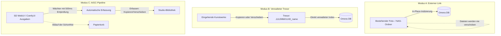

# Medienimport & Ordnermodi

Omera bietet eine flexible Ordnerarchitektur, die speziell auf moderne Arbeitsabläufe der KI-Generierung zugeschnitten ist. Anstatt Sie in eine starre Bibliotheksstruktur zu zwingen, unterstützt Omera **drei unterschiedliche Ordnermodi**, automatische Pipeline-Erfassung und eine breite Palette an Medienformaten.

---

## 1. Die drei Ordnermodi

Beim Hinzufügen eines Ordners (`Datei > Ordner hinzufügen...` oder `Strg + O`) können Sie den Modus wählen, der am besten zu Ihrem Workflow passt:



### Modus A: Externer Link & Überwachung (`link`)
- **Funktionsweise**: In-Place Zero-Copy-Indexierung.
- **Ideal für**: Bestehende NAS-Freigaben (SMB/NFS), externe Festplatten oder umfangreiche schreibgeschützte Archivsammlungen, die von Omera weder verschoben noch modifiziert werden sollen.
- **Verhalten**: Omera extrahiert Metadaten und generiert schnelle Vorschaubilder, belässt die physischen Originaldateien jedoch exakt an ihrem ursprünglichen Speicherort auf dem Datenträger.

### Modus B: Verwalteter Projekt-Tresor (`managed`)
- **Funktionsweise**: Dediziertes, intern organisiertes Anwendungs-Repository.
- **Ideal für**: Kuratierte persönliche Bibliotheken oder Studio-Portfolios, bei denen eine saubere, einheitliche Speicherstruktur gewünscht ist.
- **Verhalten**: Wenn Sie Dateien in einen verwalteten Tresor importieren oder ablegen, organisiert Omera sie automatisch in einer nach Datum unterteilten Verzeichnisstruktur:
  ```
  <Tresor_Stammverzeichnis>/
  └── 2026/
      └── 09/
          ├── 550e8400-e29b-41d4-a716-446655440000_cyberpunk_01.png
          └── 6ba7b810-9dad-11d1-80b4-00c04fd430c8_portrait_02.webp
  ```

### Modus C: ⚡ AIGC-Erfassungs-Pipeline (`pipeline`)
- **Funktionsweise**: Kontinuierliche Überwachung und automatisierte Übernahme neu generierter Ausgaben.
- **Ideal für**: Die direkte Verknüpfung mit lokalen Ausgabeordnern von **AUTOMATIC1111 / SD.Next**, **ComfyUI**, **Fooocus** oder **InvokeAI**.
- **Mechanismen der Pipeline**:
  1. **Schreibschutz-Entprellung (Write-Lock Debouncing)**: Wenn ein KI-Generator eine große PNG- oder MP4-Datei auf die Festplatte schreibt, schwankt die Dateigröße während des Schreibvorgangs. Der Wächter von Omera prüft die Dateigrößenstabilität für mindestens **500 ms**, bevor die Datei verarbeitet wird. Dies verhindert das Einlesen unvollständiger oder beschädigter Bilddaten.
  2. **Erfassungsverhalten**: Wählen Sie zwischen **Kopieren** (Original beibehalten, Kopie in der Bibliothek anlegen) oder **Verschieben** (neu erzeugte Generationen direkt in die Bibliothek übernehmen).
  3. **Auto-Harvest & Verzögerte Quellbereinigung**: Sie können eine automatische Schonfrist für das Quellverzeichnis des Generators festlegen (`Sofort`, `1 Stunde`, `24 Stunden`, `3 Tage`, `7 Tage`, `Nie`). Nach Ablauf der Schonfrist werden verarbeitete Quell-Generierungsdateien sicher in den **System-Papierkorb** verschoben. So bleibt Ihre Generierungs-SSD sauber, ohne dass Datenverlust droht.

---

## 2. Unterstützte Datei- & Medienformate

Omera analysiert Container-Header und Binärdatenströme über native Rust-Parser (`omera-metadata`), indem es Dateisignaturen (Magic Bytes) prüft, anstatt sich ausschließlich auf Dateiendungen zu verlassen:

| Container | Endungen | Header-Erkennung | Fähigkeiten zur Metadaten-Extraktion |
| :--- | :--- | :--- | :--- |
| **PNG** | `.png` | `\x89PNG\r\n\x1a\n` | Vollständige PNGInfo-Chunks: `parameters` (A1111), `prompt` & `workflow` (ComfyUI), `Comment` (NovelAI), `invokeai_metadata`, `sui_image_params`. |
| **WebP** | `.webp` | `RIFF....WEBP` | Eingebettete EXIF-Metadatenblöcke, ComfyUI-WebP-Chunk-Daten. |
| **JPEG** | `.jpg`, `.jpeg` | `\xFF\xD8\xFF` | Eingebettete EXIF APP1-Segmente (`UserComment`, `ImageDescription`, `Software`). |
| **MP4** | `.mp4` | `ftyp`-Box bei Offset 4 | ISOBMFF-Box-Parsing (`moov/udta`-eingebettetes ComfyUI-JSON, Dauer, FPS, Videocodecs). |
| **WebM** | `.webm` | `\x1A\x45\xDF\xA3` (EBML) | EBML-Videostromeigenschaften, Bilddimensionen und Sidecar-Metadaten. |
| **Sidecars** | `.txt`, `.json` | Klartext / JSON | Begleitende Sidecar-Dateien werden automatisch geladen, wenn eingebettete Chunks fehlen. |
| **Civitai** | `.civitai.info` | JSON-Format | Automatische Verknüpfung von Modell-Hash, Trigger-Wörtern und Vorschaubildern für LoRA-Checkpoints. |

---

## 3. Inkrementelle Indizierung & Dateisystem-Überwachung

Omera vermeidet langwierige, vollständige Datenträgerscans beim Programmstart:

1. **Fingerabdruck-Prüfung (Fingerprint Verification)**:
   - Dateien werden in SQLite über einen schnellen zusammengesetzten Index erfasst: `(path, size_bytes, modified_at)`.
   - Beim Start oder bei erneuten Scans vergleicht Omera den gecachten Zeitstempel und die Dateigröße. Übereinstimmende Dateien werden sofort übersprungen, ohne dass Dateiinhalte gelesen oder Metadaten-JSONs geparst werden müssen.
2. **Dauerhaftes Änderungsprotokoll (Change Journaling)**:
   - Ereignisse der Dateisystem-Überwachung (`notify` v8) werden mit einer **Entprellzeit von 750 ms** gesammelt und in SQLite (`filesystem_change_journal`) festgehalten.
   - Selbst wenn Sie 1.000 Bilder in kurzer Folge im Batch generieren, fasst Omera Ereignisse in Blöcken von 1.024 Vorgängen zusammen, was Ruckeln der Benutzeroberfläche und Datenbanksperren verhindert.
3. **Startscan-Intervall (Cooldown)**:
   - Unter **Einstellungen > Allgemein** können Sie das Startscan-Intervall festlegen (Standard: **6 Stunden**). Omera lädt die bestehende Bibliothek aus SQLite in unter 50 ms direkt beim Start und verschiebt vollständige Datenträgerabgleiche bis zum Ablauf des Intervalls.
