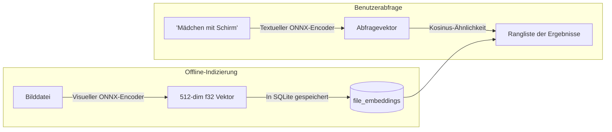

# KI-Semantische Suche & Auto-Tagging

Berry AI Studio enthält integrierte, lokale KI-Inferenzmodule für die **semantische Suche in natürlicher Sprache** (`berry-clip`) und das **Anime-/Ästhetik-Auto-Tagging** (`berry-tagger`). Alle Modelle laufen zu 100% lokal auf Ihrem Rechner über die ONNX Runtime — ohne dass Bilder oder Prompts an externe Cloud-APIs übertragen werden.

---

## 1. Semantische Suche in natürlicher Sprache (`berry-clip`)

Die traditionelle Metadatensuche findet Bilder nur dann, wenn der exakte Suchbegriff auch im Generierungs-Prompt vorkommt. Die **semantische Suche** ermöglicht es Ihnen dagegen, Bildinhalte in natürlicher Sprache zu beschreiben (z. B. *„Mädchen mit Regenschirm bei Nacht im Regen“*), woraufhin Berry passende Kunstwerke anhand konzeptioneller visueller Ähnlichkeit aufspürt.

### Einrichten der semantischen Suche
1. Öffnen Sie über **Werkzeuge > CLIP-Semantiksuchindex...** das Verwaltungsfenster (`ClipManagerModal.vue`).
2. Berry durchsucht Ihren Ordner `models/` nach kompatiblen CLIP/SigLIP-ONNX-Modellen (visueller Encoder, textueller Encoder, Tokenizer).
3. Klicken Sie auf **„Verbleibende Bilder indizieren“**: Berry berechnet im Hintergrund über Worker-Threads normalisierte Bild-Einbettungen und schreibt die Vektoren in die SQLite-Tabelle `file_embeddings` (Schema v7).
4. **Suchen**:
   - Klicken Sie in der Hauptsuchleiste auf das Gehirn-Symbol (`🧠`), um in den Modus **Semantische Suche** zu wechseln.
   - Geben Sie eine beliebige natürlichsprachliche Beschreibung ein und drücken Sie `Enter`.
   - Die Ergebnisse werden in der Galerie nach visueller Kosinus-Ähnlichkeit geordnet dargestellt.

---

## 2. Visuelle Ähnlichkeitssuche (Bild-zu-Bild)

Sie können ausgehend von jedem beliebigen Kunstwerk optisch oder stilistisch verwandte Bilder aufspüren:
1. Klicken Sie mit der rechten Maustaste auf ein Bild oder wählen Sie im Inspektor **„Ähnliche Bilder suchen“**.
2. Berry ruft den gespeicherten Einbettungsvektor ab und sucht in der Datenbank nach den nächsten Nachbarn anhand der Kosinus-Distanz.
3. Die Galerie wechselt in die **visuelle Ähnlichkeitsansicht** mit Übereinstimmungsgraden (z. B. `96% Übereinstimmung`) und einem interaktiven Ähnlichkeits-Schwellenwert-Schieberegler (0% bis 95%).

---

## 3. WD14 / Danbooru Anime-Auto-Tagger (`berry-tagger`)

Enthält Ihre Bibliothek Werke aus NovelAI, Anime-Checkpoints (Animagine, NAI, Anything) oder unverschlagwortete Kunst, kann der integrierte **WD14-Tagger** (`AutoTagModal.vue`) automatisch Danbooru-Tags erkennen und zuweisen.

### Unterstützte Modellarchitekturen:
- **SwinV2**-, **ConvNeXt**-, **ViT**- und **MOAT**-ONNX-Modelle.
- Gekoppelt mit passenden `selected_tags.csv`-Taxonomiedateien.

### Tag-Klassifizierung & Schwellenwerte:
Der Tagger unterteilt Erkennungen in drei Kategorien:
1. **Allgemeine Tags** (z. B. `1girl`, `blue eyes`, `looking at viewer`, `cherry blossoms`).
   - Standard-Konfidenzschwellenwert: `0.35` (konfigurierbar).
2. **Charakter-Tags** (erkennt namentlich bekannte Anime- und Spielfiguren).
   - Standard-Konfidenzschwellenwert: `0.85` (höherer Schwellenwert verhindert Fehlzuordnungen).
3. **Altersfreigabe-Tags (Rating)** (`general`, `sensitive`, `questionable`, `explicit`).
   - Dient der automatischen Kennzeichnung sensibler Inhalte (`is_nsfw`).

### Stapel-Verschlagwortung:
- Wählen Sie mehrere Bilder in der Galerie aus, klicken Sie in der schwebenden Aktionsleiste auf **„Auto-Tag“**, legen Sie Ihre Schwellenwerte fest und starten Sie die Verarbeitung im Hintergrund. Berry weist die erkannten farbcodierten Tags automatisch zu.
