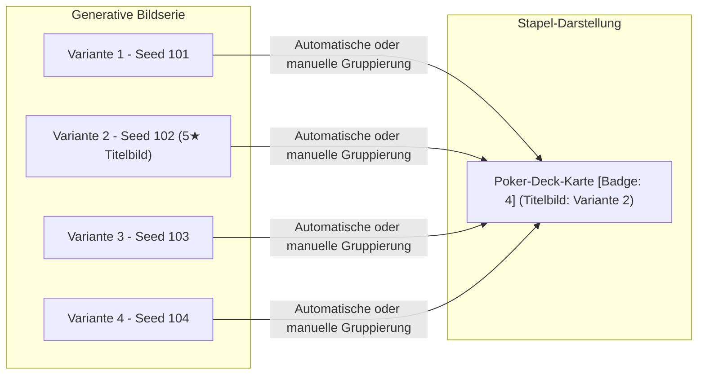

# Bildstapel, Serien & Bildvergleich

Im Workflow mit generativer KI erzeugt man häufig Serien von 10 bis 50 Bildvarianten mit identischen oder nur leicht variierten Prompts, um die beste Komposition zu finden. Ohne passende Organisationswerkzeuge wird die Bibliothek schnell von fast identischen Entwürfen überflutet.

Omera löst dieses Problem durch **intelligente Serien-Stapelbildung**, **Poker-Deck-Karten**, **autoritative Titelbild-Auswahl** und **synchronisierten Bildvergleich nebeneinander**.

---

## 1. Funktionsweise von Bildstapeln

Ein **Bilderstapel** ist eine Sammlung zusammengehöriger Bildvariationen, die auf der Galeriefläche durch ein einzelnes Vorschaubild — das sogenannte **Titelbild (Hero)** — repräsentiert wird.

### Eingeklappte vs. Ausgeklappte Stapel
- **Eingeklappt (Standard)**: Erscheint als einzelne Poker-Deck-Karte mit dezent versetzt sichtbaren Karten im Hintergrund und einem Zähler-Badge (z. B. `[ 4 ]`).
- **Ausgeklappt**: Ein Klick auf das Zähler-Badge klappt alle enthaltenen Varianten direkt in das Galerie-Raster aus, sodass jede Variante einzeln bewertet, inspiziert oder gelöscht werden kann.

---

## 2. Automatische Serien-Stapelbildung (`auto_stack_images`)

Omera kann aufeinanderfolgende Generierungsserien im Hintergrund automatisch erkennen und bündeln:

### Kriterien für die Clusterbildung:
1. **Prompt-Token-Ähnlichkeit**: Berechnet die tokenisierte Jaccard-Ähnlichkeit über die positiven Prompts. Der erforderliche Schwellenwert lässt sich unter **Einstellungen > Stapel** konfigurieren (Standard: `0.85` bzw. 85% Übereinstimmung).
2. **Zeitfenster-Nähe**: Generierungsserien entstehen meist in kurzer zeitlicher Folge. Omera fasst Varianten zusammen, die innerhalb eines konfigurierbaren Zeitfensters erzeugt wurden (Standard: `180 Minuten`).
3. **Ausführung**: Sie können das automatische Stapeln manuell über **Werkzeuge > Bibliothek nach Prompt organisieren (Alle Ordner oder Aktueller Ordner)** anstoßen oder Omera die Bilder automatisch beim Erfassen gruppieren lassen.

---

## 3. Manuelle Stapel-Operationen

Sie können Stapel jederzeit über Tastaturkürzel erstellen, auflösen und bearbeiten:

| Aktion | Tastenkürzel | Beschreibung |
| :--- | :--- | :--- |
| **In Stapel gruppieren** | `Strg + G` / `Cmd + G` | Fasst alle ausgewählten Einzelbilder oder Stapel zu einem gemeinsamen Stapel zusammen. |
| **Stapel auflösen** | `Strg + Umschalt + G` / `Cmd + Shift + G` | Löst den ausgewählten Stapel wieder in separate Einzelkarten auf. |
| **Als Titelbild festlegen** | `Alt + S` / `Option + S` | Bestimmt das aktive Bild als primäres Deckblatt (`stack_order = 0`). |

### Schutz vor Verschachtelung & Sicheres Zusammenführen
In Omera können Stapel **nicht verschachtelt werden** (ein Stapel kann keinen weiteren Stapel enthalten). Wenn Sie mehrere Stapel auswählen und `Strg + G` drücken:
- Löst Omera alle Quellstapel automatisch auf und führt die Einzelbilder in den Zielstapel zusammen.
- Ein Bestätigungsdialog (`StackMergeWarningModal.vue`) schützt vor versehentlichem Gruppieren.
- Über die Option *„Diese Warnung nicht mehr anzeigen“* können Sie den Dialog unterdrücken (lässt sich unter **Einstellungen > Stapel > Unterdrückte Warnmeldungen zurücksetzen** wiederherstellen).

---

## 4. Gestensteuerung: Einfacher vs. Doppelter Klick

Um Konflikte zwischen Auswahl- und Öffnungsaktionen zu vermeiden:
- **Einfacher Klick auf den Zähler-Badge**: Klappt den Stapel inline im Raster auf oder zu.
- **Einfacher Klick auf die Bildkarte**: Wählt den Stapel aus (mit verzögertem 240-ms-Timer).
- **Doppelklick auf die Bildkarte**: Bricht den Aufklapp-Timer sofort ab und öffnet das **Titelbild** direkt in der Vollbild-Vorschau (**Lightbox**).

---

## 5. Synchronisierter Bildvergleich nebeneinander (`CompareModal.vue`)

Um feine Unterschiede zu beurteilen (z. B. Augendetails, Fingeranatomie oder Beleuchtung):
1. Wählen Sie zwei Bilder in der Galerie aus.
2. Drücken Sie die Taste `C` (oder klicken Sie auf **Vergleichen**).
3. Das Fenster **Bildvergleich nebeneinander** öffnet sich:
   - **Bereich A (links)** und **Bereich B (rechts)** zeigen beide Bilder im direkten Vergleich.
   - **Synchroner Zoom & Pan**: Das Ziehen mit der Maus oder Zoomen mit dem Mausrad bewegt beide Bilder exakt synchron — für mühelose 1:1-Pixelprüfungen.
   - **HUD-Parametervergleich**: Hebt Unterschiede bei Seed, Modell, Schritten und CFG-Skala übersichtlich hervor.
   - **Schaltfläche „Als primäres Titelbild festlegen“**: Bestimmt den Favoriten als Deckblatt des Bilderstapels.

---

## 6. Niedrig bewertete Entwürfe aussortieren (`CullDraftsModal.vue`)

Sobald Sie Ihr Titelbild gewählt und Ihre Favoriten bewertet haben:
1. Wählen Sie den Stapel aus und klicken Sie in der schwebenden Aktionsleiste auf **„Aussortieren“**.
2. Das Fenster zeigt alle Entwurfsbilder des Stapels an, deren Bewertung unter Ihrem Schwellenwert liegt.
3. Klicken Sie auf **„In den Papierkorb verschieben“**, um nicht benötigte Variationen mit einem Klick in den System-Papierkorb zu befördern. So sparen Sie wertvollen Speicherplatz, während Ihre Spitzenwerke sicher erhalten bleiben.
