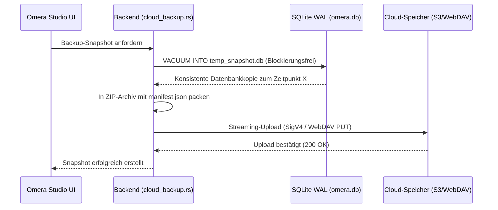

# Cloud-Snapshot-Backup & Medienspiegelung

Omera verfügt über integrierte Module für Cloud-Backups und Delta-Synchronisation (`src-tauri/src/cloud_backup.rs` und `src-tauri/src/cloud_sync.rs`), die automatisierte Datenbanksicherungen und inkrementelle Medienspiegelungen ohne externe Hilfswerkzeuge ermöglichen.

---

## 1. Unterstützte Speicheranbieter

Konfigurieren Sie Remote-Endpunkte unter **Einstellungen > Cloud & Backup**:

| Anbieter | Unterstützte Protokolle / Endpunkte | Besonderheiten |
| :--- | :--- | :--- |
| **AWS S3 / Kompatibel** | AWS S3, Cloudflare R2, MinIO, Backblaze B2, Wasabi | Reine Rust-basierte AWS Signature Version 4 (SigV4)-Authentifizierung mit HMAC-SHA256-Signierung. |
| **WebDAV** | Nextcloud, ownCloud, Synology DiskStation, QNAP NAS | Standardmäßige HTTP-Basic-Authentifizierung über verschlüsseltes HTTPS. |
| **Lokales / Netzwerkverzeichnis** | Lokale Laufwerke, externe USB-SSDs, SMB- / NFS-Netzwerkfreigaben | Direkte, extrem schnelle Dateisystem-E/A ohne Protokoll-Overhead. |

---

## 2. Konsistente SQLite-Snapshots im laufenden Betrieb (`cloud_backup_create_snapshot`)

Omera sichert Ihre Datenbank über den nativen SQLite-Befehl `VACUUM INTO`:

### Snapshot-Garantien:
- **Blockierungsfrei (Non-Locking)**: Nutzt die Online-Vacuum-API von SQLite. Sie können ohne Unterbrechung weiter in der Galerie arbeiten, bewerten und Bilder generieren.
- **Rollback-Sicherheit**: Beim Wiederherstellen eines Snapshots erstellt Omera automatisch eine lokale Sicherheitskopie (`omera.db.rollback`), bevor die Remote-Datenbank eingespielt wird. Dies schützt vor Netzwerkabbrüchen oder beschädigten Downloads.

---

## 3. Inkrementelle Medienspiegelung & Delta-Sync (`cloud_sync.rs`)

Während Snapshots Ihre Datenbankstruktur und Metadaten sichern, spiegelt der **Delta-Sync** die physischen Bild- und Videodateien zwischen lokalem Speicher und Cloud-Ziel.

### Synchronisationsfähigkeiten:
- **Strategien zur Änderungserkennung**:
  - *Schneller Fingerabdruck*: Vergleicht die lokale Dateigröße und den Remote-HTTP-ETag (besonders schnell bei langsameren Verbindungen).
  - *Strikte Prüfsumme*: Berechnet fortlaufende SHA-256-Prüfsummen für eine garantierte Byte-für-Byte-Konsistenz.
- **Bandbreitenbegrenzung (Token-Bucket)**: Legen Sie ein Upload-Limit (KB/s) fest, damit Hintergrundübertragungen die Internetleitung Ihres Studios nicht blockieren.
- **Übertragungs-Threads (Worker Concurrency)**: Konfigurierbare Thread-Anzahl (1 bis 8 parallele Uploads).
- **Testlauf-Modus (Dry-Run)**: Simuliert den Abgleich und meldet hochzuladende, zu überspringende oder zu löschende Dateien, ohne Daten auf dem Remote-Speicher zu verändern.
- **Echtzeit-Fortschrittsanzeige**: Sendet kontinuierliche Status-Updates mit übertragenen Bytes, Durchsatzrate, Prozentsatz und geschätzter Restzeit (ETA).
