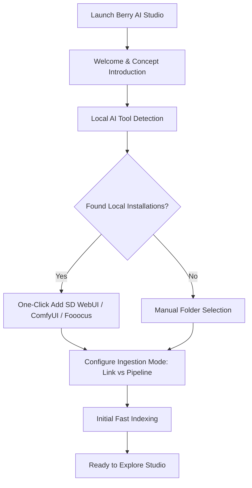

# Installation & First Launch

This guide details system requirements, supported platforms, installation procedures, and the first-run onboarding setup for **Berry AI Studio**.

---

## 1. System Requirements

Berry AI Studio uses an ultra-efficient native architecture powered by **Tauri v2**, **Rust**, and **SQLite WAL**. It runs smoothly on modest hardware while fully utilizing multi-core workstations and NVMe storage for large libraries (50,000 to 500,000+ files).

### Minimum Hardware Requirements
- **CPU**: Dual-core x86_64 or ARM64 processor (Intel Core i3 / AMD Ryzen 3 / Apple M1 or newer).
- **RAM**: 4 GB RAM (8 GB+ recommended for running local CLIP/WD14 ONNX models).
- **Storage**: ~150 MB for application installation; additional space for thumbnails (configurable 2 GB default LRU cache) and media files.
- **Display Resolution**: 1280 × 800 minimum viewport (responsive down to 960 × 640).

### Supported Operating Systems
| Operating System | Supported Versions | Architecture | Package Types |
| :--- | :--- | :--- | :--- |
| **Windows** | Windows 10 (1809+) & Windows 11 | `x86_64` (64-bit) | Standard Installer (`.exe`), Portable (`.zip`) |
| **macOS** | macOS 12 (Monterey) or later | `aarch64` (Apple Silicon M1/M2/M3/M4) & `x86_64` (Intel) | Disk Image (`.dmg`), Universal Binary |
| **Linux** | Ubuntu 20.04+, Debian 11+, Fedora 36+, Arch Linux | `x86_64` | AppImage (`.AppImage`), Debian package (`.deb`) |

---

## 2. Installation Procedures

Download official production packages from the [GitHub Releases Page](https://github.com/BerryUIKI/Berry-AI-Studio/releases) or the [Official Website](https://berryuiki.github.io/Berry-AI-Studio/).

### Windows
1. **Standard Installer (`Berry-AI-Studio_Windows_x64.exe`)**:
   - Double-click the installer executable.
   - Follow the setup wizard to choose the installation location and create desktop/start menu shortcuts.
   - The installer automatically manages desktop shortcuts and register protocol handlers.
2. **Portable ZIP (`Berry-AI-Studio_Windows_x64.zip`)**:
   - Extract the `.zip` archive to your preferred drive (e.g., an external NVMe SSD or portable drive).
   - Run `berry-ai-studio.exe` directly without administrative privileges.

### macOS
1. Download the disk image corresponding to your CPU:
   - Apple Silicon (M1/M2/M3/M4): `Berry-AI-Studio_macOS_aarch64.dmg`
   - Intel Core: `Berry-AI-Studio_macOS_x64.dmg`
2. Open the `.dmg` file and drag **Berry AI Studio** into your `/Applications` folder.
3. Packages are signed and notarized by Apple Gatekeeper. On first launch, launch from Applications or Spotlight.

### Linux
1. **AppImage (`Berry-AI-Studio_Linux_x64.AppImage`)**:
   - Make the binary executable:
     ```bash
     chmod +x Berry-AI-Studio_Linux_x64.AppImage
     ./Berry-AI-Studio_Linux_x64.AppImage
     ```
2. **Debian / Ubuntu (`Berry-AI-Studio_Linux_x64.deb`)**:
   - Install via `dpkg` or `apt`:
     ```bash
     sudo dpkg -i Berry-AI-Studio_Linux_x64.deb
     sudo apt-get install -f # Resolve any missing webkit2gtk dependencies
     ```

---

## 3. First-Run Onboarding Wizard

When you launch Berry AI Studio for the first time, the interactive **Onboarding Wizard** (`OnboardingModal.vue`) appears automatically to guide you through setup.



### Onboarding Steps:
1. **Welcome Screen**: Introduces the 3 core pillars:
   - High-speed local indexing with lossless generation metadata extraction.
   - Intelligent poker-card burst stacking and side-by-side comparison.
   - 100% offline privacy with zero telemetry.
2. **Local AI Engine Auto-Detection**:
   - Berry probes common local directories across all drives (e.g., `C:\`, `D:\`, `/home/`) looking for outputs from:
     - **AUTOMATIC1111 / SD.Next** (`outputs/txt2img-images`, `outputs/img2img-images`)
     - **ComfyUI** (`ComfyUI/output`)
     - **Fooocus** (`Fooocus/outputs`)
     - **InvokeAI** (`invokeai/outputs`)
   - If detected, you can connect them with a single click as **AIGC Pipelines** or **External Links**.
3. **Select Storage Mode**:
   - Choose how Berry interacts with your files (read more in [Folder Modes & Importing](../02-library-management/folder-modes-and-import.md)).
4. **Completion**:
   - Berry initializes the local SQLite database (`berry.db`) in Write-Ahead Logging (WAL) mode, starts background folder scanning, and brings you directly into the main studio gallery.

---

## 4. Application Storage & Data Directory

Berry AI Studio stores all library indexes, caches, and configuration locally in your user profile:

- **Windows**: `%APPDATA%\com.berryuiki.berryaistudio\` (e.g., `C:\Users\<User>\AppData\Roaming\com.berryuiki.berryaistudio\`)
- **macOS**: `~/Library/Application Support/com.berryuiki.berryaistudio/`
- **Linux**: `~/.config/com.berryuiki.berryaistudio/`

### Directory Contents:
- `berry.db`: The primary SQLite database containing all metadata, ratings, tags, albums, and stack relationships.
- `berry.db-wal` & `berry.db-shm`: SQLite WAL journal files.
- `config.json`: Application settings (theme, view mode, thumbnail resolution, interop URLs).
- `thumbnails/`: High-efficiency WebP thumbnail cache organized by `{file_id}_{mtime}_{edge}.webp`.
- `models/`: Local ONNX AI weights for CLIP, SigLIP, and WD14 Danbooru auto-taggers.

> [!TIP]
> You can instantly open these locations at any time from **Settings > Storage & About** using the dedicated "Open Folder" buttons.
