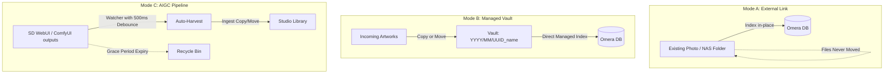

# Importing Media & Folder Modes

Omera provides a flexible folder architecture designed for modern AI generation workflows. Rather than forcing you into a single rigid library structure, Omera supports **three distinct folder modes**, automatic pipeline harvesting, and broad media format support.

---

## 1. The Three Folder Modes

When adding a folder (`File > Add Folder...` or `Ctrl + O`), you can choose the mode that best fits your workflow:



### Mode A: External Link (`link`)
- **How it works**: In-place, zero-copy indexing.
- **Best for**: Existing NAS shares (SMB/NFS), external hard drives, or massive read-only archive collections that you do not want Omera to modify or rearrange.
- **Behavior**: Omera extracts metadata and builds fast thumbnails, but leaves the physical files exactly where they are on disk.

### Mode B: Managed Project Vault (`managed`)
- **How it works**: Dedicated, organized application repository.
- **Best for**: Curated personal libraries or studio portfolios where you want a clean, unified storage root.
- **Behavior**: When you drop or import files into a Managed Vault, Omera automatically organizes them into a date-partitioned physical structure:
  ```
  <Vault_Root>/
  └── 2026/
      └── 09/
          ├── 550e8400-e29b-41d4-a716-446655440000_cyberpunk_01.png
          └── 6ba7b810-9dad-11d1-80b4-00c04fd430c8_portrait_02.webp
  ```

### Mode C: AIGC Ingestion Pipeline (`pipeline`)
- **How it works**: Active surveillance and automated harvesting of generative AI output directories.
- **Best for**: Connecting directly to your local **AUTOMATIC1111 / SD.Next**, **ComfyUI**, **Fooocus**, or **InvokeAI** output folders.
- **Pipeline Mechanics**:
  1. **Write-Lock Debouncing**: When an image generator begins writing a large PNG or MP4 to disk, the file size fluctuates. Omera's watcher monitors file size stability for **500 ms** before touching the file, preventing ingestion of half-rendered corrupt images.
  2. **Ingest Action**: Choose between **Copy** (duplicates into your library) or **Move** (moves newly finished generations directly into Omera).
  3. **Auto-Harvest & Delayed Cleanup**: You can set an automatic grace period for the source generator directory (`Immediate`, `1 hour`, `24 hours`, `3 days`, `7 days`, `Never`). Once the grace period expires, processed generator output files are safely transferred to your **OS Recycle Bin / Trash**, keeping your generator output drive clean without risking data loss.

---

## 2. Supported File & Media Formats

Omera parses container headers and binary streams using native Rust parsers (`omera-metadata`), sniffing magic bytes rather than relying strictly on file extensions:

| Container | Extensions | Sniffing Header | Generation Metadata Capabilities |
| :--- | :--- | :--- | :--- |
| **PNG** | `.png` | `\x89PNG\r\n\x1a\n` | Complete PNGInfo chunks: `parameters` (A1111), `prompt` & `workflow` (ComfyUI), `Comment` (NovelAI), `invokeai_metadata`, `sui_image_params`. |
| **WebP** | `.webp` | `RIFF....WEBP` | Embedded EXIF metadata blocks, ComfyUI WebP chunk data. |
| **JPEG** | `.jpg`, `.jpeg` | `\xFF\xD8\xFF` | Embedded EXIF APP1 segments (`UserComment`, `ImageDescription`, `Software`). |
| **MP4** | `.mp4` | `ftyp` box at offset 4 | ISOBMFF box parsing (`moov/udta` embedded ComfyUI JSON, duration, FPS, video codecs). |
| **WebM** | `.webm` | `\x1A\x45\xDF\xA3` (EBML) | EBML video stream properties, frame dimensions, and sidecar metadata. |
| **Sidecars** | `.txt`, `.json` | Plain text / JSON | Companion sidecars loaded automatically if embedded chunks are missing. |
| **Civitai** | `.civitai.info` | JSON format | Auto-associates model hash, trigger words, and preview art for LoRA checkpoints. |

---

## 3. Incremental Indexing & Filesystem Watching

Omera avoids traditional, slow disk walks on startup:

1. **Fingerprint Verification**:
   - Files are tracked in SQLite via a fast lightweight composite index: `(path, size_bytes, modified_at)`.
   - On startup or rescans, Omera compares the cached timestamp and size. Files that match are skipped instantly without reading file contents or parsing metadata JSON.
2. **Durable Change Journaling**:
   - Filesystem watcher events (`notify` v8) are debounced with a **750 ms quiet period** and written to SQLite (`filesystem_change_journal`).
   - Even if you generate 1,000 images in a rapid batch run, Omera batches events into 1,024-event chunks, preventing UI stuttering and database lock contention.
3. **Startup Scan Cooldown**:
   - In **Settings > General**, you can configure the startup scan interval (default: **360 minutes / 6 hours**). Omera renders your existing library from SQLite in under 50 ms upon launch, deferring full disk reconciliation until necessary.
