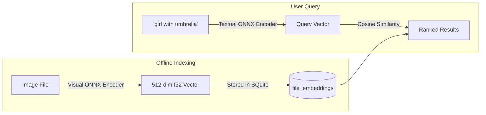

# AI Semantic Search & Auto-Tagging

Omera includes embedded, local AI inference engines for **Natural Language Semantic Search** (`omera-clip`) and **Anime/Aesthetic Auto-Tagging** (`omera-tagger`). All models run 100% locally on your machine via ONNX Runtime without sending images or prompts to external cloud APIs.

---

## 1. Natural Language Semantic Search (`omera-clip`)

Traditional metadata search only finds images if your exact search keyword was written in the generation prompt. **Semantic Search** allows you to describe what an artwork looks like in natural language (e.g. *"girl with umbrella in rain at night"*), and Omera will find matching images based on conceptual visual similarity.

### Setting Up Semantic Search
1. Click **Tools > CLIP Semantic Search Index** to open the management modal (`ClipManagerModal.vue`).
2. Omera scans your `models/` directory for compatible CLIP/SigLIP ONNX models (visual encoder, textual encoder, tokenizer).
3. Click **"Batch Index Images"**: Omera computes normalized visual embeddings using background worker threads and writes the resulting vectors to the `file_embeddings` SQLite table (Schema v7).
4. **Searching**:
   - In the main search bar, click the brain icon (`🧠`) to toggle into **Semantic Mode**.
   - Type any natural language phrase and press `Enter`.
   - Results are displayed in the gallery ranked by visual cosine similarity.

---

## 2. Visual Similarity Search (Image-to-Image)

You can find visually or stylistically related images directly from any existing artwork:
1. Right-click any image or click **"Find Similar"** in the Inspector.
2. Omera extracts the image's stored embedding vector and queries the database for nearest neighbors using cosine distance.
3. The gallery switches to **Visual Similarity View**, showing match percentages (e.g., `96% Match`) with an interactive similarity threshold slider (0% to 95%).

---

## 3. WD14 / Danbooru Anime Auto-Tagger (`omera-tagger`)

If your library contains images from NovelAI, anime checkpoints (Animagine, NAI, Anything), or unlabeled art, Omera's embedded **WD14 Tagger** (`AutoTagModal.vue`) can automatically detect and attach Danbooru tags.

### Supported Model Architectures:
- **SwinV2**, **ConvNeXt**, **ViT**, and **MOAT** ONNX models.
- Paired with `selected_tags.csv` taxonomy files.

### Tag Classification & Thresholds:
The tagger categorizes predictions into three distinct groups:
1. **General Tags** (e.g. `1girl`, `blue eyes`, `looking at viewer`, `cherry blossoms`).
   - Default confidence threshold: `0.35` (configurable).
2. **Character Tags** (identifies specific named anime/game characters).
   - Default confidence threshold: `0.85` (higher threshold prevents false positives).
3. **Rating Tags** (`general`, `sensitive`, `questionable`, `explicit`).
   - Used to automatically set sensitive content flags (`is_nsfw`).

### Batch Tagging:
- Select multiple images in the gallery, click **"Auto-Tag"** on the floating Batch Action Bar, configure your confidence thresholds, and Omera will process the batch in the background, attaching color-coded tags to your library automatically.
