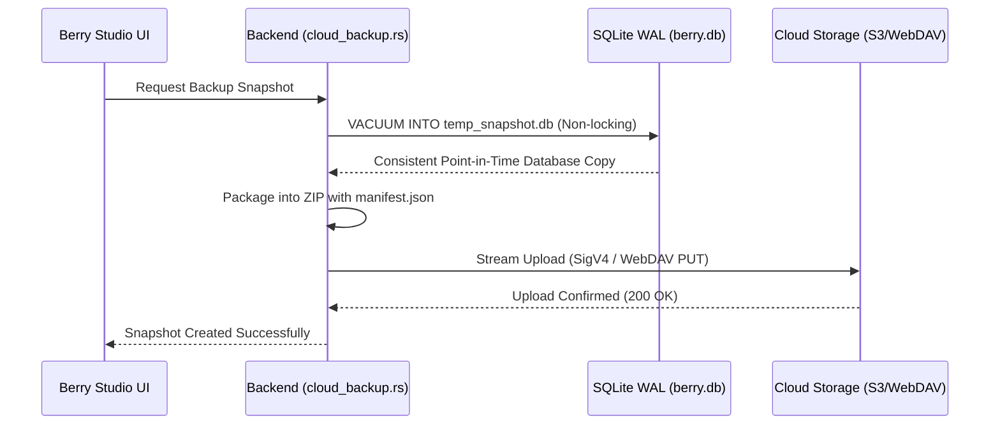

# Cloud Snapshot Backup & Media Mirroring

Berry AI Studio includes a cloud backup and delta sync engine (`src-tauri/src/cloud_backup.rs` and `src-tauri/src/cloud_sync.rs`) that enables automated database backups and incremental remote media mirroring without third-party tools.

---

## 1. Supported Storage Providers

Configure remote endpoints in **Settings > Cloud Backup**:

| Provider | Supported Protocols / Endpoints | Notes |
| :--- | :--- | :--- |
| **AWS S3 / Compatible** | AWS S3, Cloudflare R2, MinIO, Backblaze B2, Wasabi | Pure-Rust AWS Signature Version 4 (SigV4) authentication with HMAC-SHA256 signing. |
| **WebDAV** | Nextcloud, ownCloud, Synology DiskStation, QNAP NAS | Standard HTTP Basic Authentication over HTTPS. |
| **Local / Network Path** | Local drive, external USB SSD, SMB / NFS network shares | Direct high-speed filesystem I/O without network protocol overhead. |

---

## 2. Hot SQLite Snapshot Backups (`cloud_backup_create_snapshot`)

Berry backs up your database using SQLite's native `VACUUM INTO` command:

### Snapshot Guarantees:
- **Non-Locking**: Uses SQLite's online vacuum API. You can continue browsing, rating, and generating images without interruption.
- **Rollback Safety**: When restoring a snapshot, Berry creates an automatic local safety copy (`berry.db.rollback`) before applying the remote snapshot, protecting against network drops or corrupted downloads.

---

## 3. Incremental Media Mirroring & Delta Sync (`cloud_sync.rs`)

While snapshots protect your database, **Delta Sync** mirrors physical image and video files between your local drive and remote cloud storage.

### Sync Capabilities:
- **Change Detection Strategies**:
  - *Fast Fingerprint*: Compares local file size and remote HTTP ETag (fastest, ideal for slow connections).
  - *Strict Checksum*: Computes streaming SHA-256 hashes to guarantee byte-for-byte fidelity.
- **Token-Bucket Bandwidth Limiter**: Set an upload speed ceiling (KB/s) so background cloud syncing does not saturate your studio's internet bandwidth.
- **Worker Concurrency**: Configure upload thread counts (1 to 8 threads).
- **Dry-Run Mode**: Simulates sync execution and reports files to upload, skip, or delete without modifying remote storage.
- **Live Progress Reporting**: Emits real-time progress events showing transferred bytes, throughput speed, percentage complete, and ETA.
