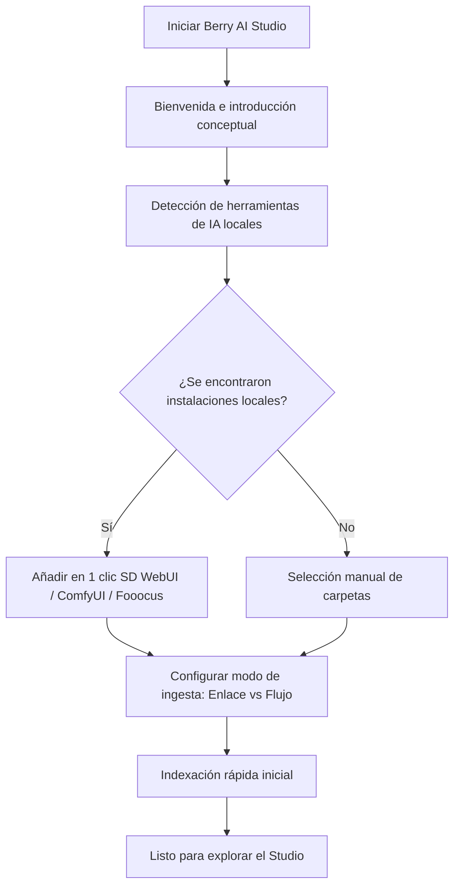

# Instalación y primer inicio

Esta guía detalla los requisitos del sistema, las plataformas compatibles, los procedimientos de instalación y la configuración inicial a través del asistente de bienvenida para **Berry AI Studio**.

---

## 1. Requisitos del sistema

Berry AI Studio utiliza una arquitectura nativa ultraeficiente impulsada por **Tauri v2**, **Rust** y **SQLite WAL**. Funciona con fluidez en hardware modesto y aprovecha al máximo las estaciones de trabajo multinúcleo y el almacenamiento NVMe para bibliotecas masivas (de 50.000 a más de 500.000 archivos).

### Requisitos mínimos de hardware
- **CPU**: Procesador de doble núcleo x86_64 o ARM64 (Intel Core i3 / AMD Ryzen 3 / Apple M1 o superior).
- **RAM**: 4 GB de RAM (se recomiendan 8 GB o más para ejecutar modelos locales ONNX CLIP/WD14).
- **Almacenamiento**: ~150 MB para la instalación de la aplicación; espacio adicional para miniaturas (caché LRU predeterminada configurable de 2 GB) y archivos multimedia.
- **Resolución de pantalla**: Área de visualización mínima de 1280 × 800 (adaptable dinámicamente hasta 960 × 640).

### Sistemas operativos compatibles
| Sistema operativo | Versiones compatibles | Arquitectura | Tipos de paquete |
| :--- | :--- | :--- | :--- |
| **Windows** | Windows 10 (1809+) y Windows 11 | `x86_64` (64 bits) | Instalador estándar (`.exe`), Portátil (`.zip`) |
| **macOS** | macOS 12 (Monterey) o posterior | `aarch64` (Apple Silicon M1/M2/M3/M4) y `x86_64` (Intel) | Imagen de disco (`.dmg`), Binario universal |
| **Linux** | Ubuntu 20.04+, Debian 11+, Fedora 36+, Arch Linux | `x86_64` | AppImage (`.AppImage`), Paquete Debian (`.deb`) |

---

## 2. Procedimientos de instalación

Descargue los paquetes oficiales de producción desde la [Página de lanzamientos de GitHub](https://github.com/BerryUIKI/Berry-AI-Studio/releases) o el [Sitio web oficial](https://berryuiki.github.io/Berry-AI-Studio/).

### Windows
1. **Instalador estándar (`Berry-AI-Studio_Windows_x64.exe`)**:
   - Haga doble clic en el archivo ejecutable del instalador.
   - Siga el asistente de instalación para elegir la ruta de instalación y crear accesos directos en el escritorio y el menú Inicio.
   - El instalador gestiona automáticamente los accesos directos y registra los controladores de protocolo del sistema.
2. **Archivo ZIP portátil (`Berry-AI-Studio_Windows_x64.zip`)**:
   - Extraiga el archivo `.zip` en la unidad que prefiera (por ejemplo, una unidad SSD NVMe externa o un pendrive portátil).
   - Ejecute `berry-ai-studio.exe` directamente sin requerir privilegios de administrador.

### macOS
1. Descargue la imagen de disco correspondiente a su procesador:
   - Apple Silicon (M1/M2/M3/M4): `Berry-AI-Studio_macOS_aarch64.dmg`
   - Intel Core: `Berry-AI-Studio_macOS_x64.dmg`
2. Abra el archivo `.dmg` y arrastre **Berry AI Studio** a su carpeta `/Applications`.
3. Los paquetes están firmados y certificados por Apple Gatekeeper. En el primer inicio, ejecútelo desde Aplicaciones o Spotlight.

### Linux
1. **AppImage (`Berry-AI-Studio_Linux_x64.AppImage`)**:
   - Conceda permisos de ejecución al binario:
     ```bash
     chmod +x Berry-AI-Studio_Linux_x64.AppImage
     ./Berry-AI-Studio_Linux_x64.AppImage
     ```
2. **Debian / Ubuntu (`Berry-AI-Studio_Linux_x64.deb`)**:
   - Instale mediante `dpkg` o `apt`:
     ```bash
     sudo dpkg -i Berry-AI-Studio_Linux_x64.deb
     sudo apt-get install -f # Resuelve las dependencias webkit2gtk que falten
     ```

---

## 3. Asistente de bienvenida inicial (Onboarding Wizard)

Al iniciar Berry AI Studio por primera vez, se abre automáticamente el **Asistente de bienvenida interactivo** (`OnboardingModal.vue`) para guiarle durante la configuración.



### Pasos del asistente de bienvenida:
1. **Pantalla de bienvenida**: Presenta los 3 pilares fundamentales:
   - Indexación local de alta velocidad con extracción sin pérdidas de metadatos de generación.
   - Agrupación inteligente de ráfagas en baraja de cartas y comparación lado a lado.
   - Privacidad 100% en local sin telemetría alguna.
2. **Detección automática de motores de IA locales**:
   - Berry busca en directorios locales habituales de todas las unidades (p. ej., `C:\`, `D:\`, `/home/`) las salidas generadas por:
     - **AUTOMATIC1111 / SD.Next** (`outputs/txt2img-images`, `outputs/img2img-images`)
     - **ComfyUI** (`ComfyUI/output`)
     - **Fooocus** (`Fooocus/outputs`)
     - **InvokeAI** (`invokeai/outputs`)
   - Si se detectan, puede conectarlas con un solo clic como **Flujos de ingesta AIGC** o **Enlaces externos**.
3. **Seleccionar el modo de almacenamiento**:
   - Elija cómo interactúa Berry con sus archivos (lea más en [Modos de carpeta e importación](../02-library-management/folder-modes-and-import.md)).
4. **Finalización**:
   - Berry inicializa la base de datos local SQLite (`berry.db`) en modo Write-Ahead Logging (WAL), inicia el escaneo de carpetas en segundo plano y le dirige directamente a la galería principal del estudio.

---

## 4. Directorio de datos y almacenamiento de la aplicación

Berry AI Studio almacena todos los índices de la biblioteca, cachés y archivos de configuración localmente en el perfil del usuario:

- **Windows**: `%APPDATA%\com.berryuiki.berryaistudio\` (p. ej., `C:\Users\<Usuario>\AppData\Roaming\com.berryuiki.berryaistudio\`)
- **macOS**: `~/Library/Application Support/com.berryuiki.berryaistudio/`
- **Linux**: `~/.config/com.berryuiki.berryaistudio/`

### Contenido del directorio:
- `berry.db`: Base de datos principal de SQLite que contiene todos los metadatos, puntuaciones, etiquetas, álbumes y relaciones de pilas.
- `berry.db-wal` y `berry.db-shm`: Archivos de diario WAL de SQLite.
- `config.json`: Ajustes de la aplicación (tema, modo de vista, resolución de miniaturas, URLs de interoperabilidad).
- `thumbnails/`: Caché de miniaturas WebP de alta eficiencia organizadas por `{file_id}_{mtime}_{edge}.webp`.
- `models/`: Pesos locales de IA en formato ONNX para CLIP, SigLIP y el autoetiquetador Danbooru WD14.

> [!TIP]
> Puede abrir estas ubicaciones al instante en cualquier momento desde **Preferencias > Almacenamiento e info** utilizando los botones específicos de «Abrir carpeta».
