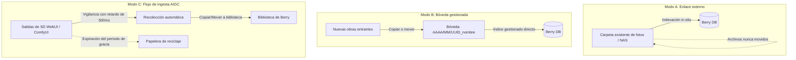

# Importación de medios y modos de carpeta

Berry AI Studio proporciona una arquitectura de carpetas flexible diseñada para los flujos de trabajo modernos de generación por IA. En lugar de forzar una única estructura rígida de biblioteca, Berry admite **tres modos de carpeta diferenciados**, recolección automatizada mediante flujos de ingesta y amplia compatibilidad con formatos multimedia.

---

## 1. Los tres modos de carpeta

Al añadir una carpeta (`Archivo > Añadir carpeta...` o `Ctrl + O`), puede elegir el modo que mejor se adapte a su forma de trabajar:



### Modo A: Enlace externo (`link`)
- **Cómo funciona**: Indexación local in situ sin copia (zero-copy).
- **Ideal para**: Recursos compartidos de NAS (SMB/NFS), discos duros externos o colecciones masivas de archivo de solo lectura que no desea que Berry mueva o reestructure.
- **Comportamiento**: Berry extrae metadatos y crea miniaturas rápidas, pero deja los archivos físicos exactamente donde están en el disco.

### Modo B: Bóveda de proyecto gestionada (`managed`)
- **Cómo funciona**: Repositorio de la aplicación dedicado y estrictamente organizado.
- **Ideal para**: Bibliotecas personales curadas o portafolios de estudio donde se desea una raíz de almacenamiento limpia y unificada.
- **Comportamiento**: Al arrastrar o importar archivos a una bóveda gestionada, Berry los organiza automáticamente en una estructura física particionada por fecha:
  ```
  <Raiz_Boveda>/
  └── 2026/
      └── 09/
          ├── 550e8400-e29b-41d4-a716-446655440000_cyberpunk_01.png
          └── 6ba7b810-9dad-11d1-80b4-00c04fd430c8_portrait_02.webp
  ```

### Modo C: Flujo de ingesta AIGC (`pipeline`)
- **Cómo funciona**: Vigilancia activa y recolección automatizada de los directorios de salida de generadores de IA.
- **Ideal para**: Conexión directa con las carpetas de salida locales de **AUTOMATIC1111 / SD.Next**, **ComfyUI**, **Fooocus** o **InvokeAI**.
- **Mecánica del flujo de ingesta**:
  1. **Estabilización de escritura (Debounce)**: Cuando un generador de imágenes empieza a escribir un archivo PNG o MP4 pesado en el disco, su tamaño fluctúa. El monitor de Berry comprueba la estabilidad del tamaño durante **500 ms** antes de interactuar con el archivo, evitando procesar imágenes a medio renderizar o corruptas.
  2. **Acción de ingesta**: Elija entre **Copiar** (duplica en su biblioteca manteniendo el original) o **Mover** (traslada directamente las nuevas generaciones a Berry).
  3. **Recolección y limpieza retardada**: Puede configurar un período de gracia automático para el directorio origen del generador (`Inmediato`, `1 hora`, `24 horas`, `3 días`, `7 días`, `Nunca`). Una vez transcurrido este plazo, los archivos ya procesados se trasladan con seguridad a la **Papelera de reciclaje del sistema**, manteniendo limpio el disco de generación sin riesgos de pérdida accidental.

---

## 2. Formatos de archivo y medios compatibles

Berry AI Studio analiza las cabeceras de los contenedores y los flujos binarios mediante analizadores nativos en Rust (`berry-metadata`), detectando bytes mágicos en lugar de depender únicamente de las extensiones de archivo:

| Contenedor | Extensiones | Cabecera (Magic Bytes) | Capacidades de metadatos de generación |
| :--- | :--- | :--- | :--- |
| **PNG** | `.png` | `\x89PNG\r\n\x1a\n` | Bloques PNGInfo completos: `parameters` (A1111), `prompt` y `workflow` (ComfyUI), `Comment` (NovelAI), `invokeai_metadata`, `sui_image_params`. |
| **WebP** | `.webp` | `RIFF....WEBP` | Bloques de metadatos EXIF incrustados, datos en fragmentos WebP de ComfyUI. |
| **JPEG** | `.jpg`, `.jpeg` | `\xFF\xD8\xFF` | Segmentos EXIF APP1 incrustados (`UserComment`, `ImageDescription`, `Software`). |
| **MP4** | `.mp4` | Caja `ftyp` en offset 4 | Análisis de cajas ISOBMFF (JSON de ComfyUI incrustado en `moov/udta`, duración, FPS, códecs de vídeo). |
| **WebM** | `.webm` | `\x1A\x45\xDF\xA3` (EBML) | Propiedades del flujo de vídeo EBML, dimensiones de fotograma y metadatos auxiliares. |
| **Archivos auxiliares (Sidecar)** | `.txt`, `.json` | Texto plano / JSON | Archivos complementarios cargados automáticamente si faltan los bloques incrustados. |
| **Civitai** | `.civitai.info` | Formato JSON | Asocia automáticamente el hash del modelo, las palabras disparadoras y la imagen de vista previa para checkpoints y LoRAs. |

---

## 3. Indexación incremental y monitorización del sistema de archivos

Berry AI Studio evita los lentos recorridos de disco tradicionales en cada inicio:

1. **Verificación por huella digital (Fingerprint)**:
   - Los archivos se registran en SQLite mediante un índice compuesto ligero: `(path, size_bytes, modified_at)`.
   - En el inicio o durante los reescaneos, Berry compara la marca de tiempo y el tamaño almacenados en caché. Los archivos idénticos se omiten al instante sin necesidad de leer su contenido ni analizar JSON de metadatos.
2. **Registro duradero de cambios (Change Journal)**:
   - Los eventos del monitor del sistema de archivos (`notify` v8) se agrupan con un **período de calma de 750 ms** y se guardan en SQLite (`filesystem_change_journal`).
   - Aunque genere 1.000 imágenes en una sesión rápida de ráfagas, Berry procesa los eventos en lotes de 1.024 registros, evitando caídas de rendimiento en la interfaz y bloqueos en la base de datos.
3. **Enfriamiento del escaneo inicial**:
   - En **Preferencias > General**, puede configurar el intervalo de escaneo inicial (predeterminado: **6 horas / 360 minutos**). Berry muestra su biblioteca existente desde SQLite en menos de 50 ms al arrancar, aplazando la conciliación completa de disco hasta que sea necesario.
