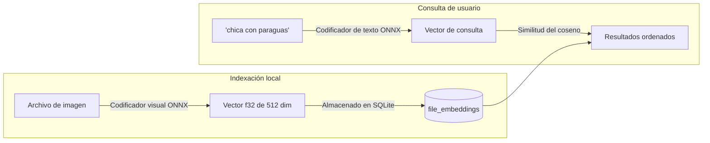

# Búsqueda semántica con IA y autoetiquetado

Berry AI Studio incorpora motores de inferencia local de IA para **Búsqueda semántica en lenguaje natural** (`berry-clip`) y **Autoetiquetado estético/anime** (`berry-tagger`). Todos los modelos se ejecutan 100% en local en su propio equipo mediante ONNX Runtime, sin enviar jamás imágenes ni prompts a servicios externos en la nube.

---

## 1. Búsqueda semántica en lenguaje natural (`berry-clip`)

La búsqueda tradicional basada en metadatos solo localiza imágenes si la palabra clave exacta coincidía en el prompt de generación. La **Búsqueda semántica** le permite describir visualmente una obra en lenguaje natural (p. ej., *"chica con paraguas bajo la lluvia de noche"*), y Berry encontrará imágenes afines según su similitud conceptual y visual.

### Configuración de la búsqueda semántica
1. Seleccione **Herramientas > Índice de búsqueda semántica CLIP...** para abrir la ventana de gestión (`ClipManagerModal.vue`).
2. Berry examina su carpeta `models/` en busca de modelos compatibles CLIP/SigLIP en formato ONNX (codificador visual, codificador textual y tokenizador).
3. Haga clic en **«Indexar imágenes restantes»**: Berry calcula los embeddings visuales normalizados mediante hilos de trabajo en segundo plano y escribe los vectores en la tabla SQLite `file_embeddings` (Esquema v7).
4. **Búsqueda**:
   - En la barra de búsqueda principal, haga clic en el icono de cerebro (`🧠`) para cambiar al modo **Búsqueda semántica**.
   - Escriba cualquier descripción en lenguaje natural y pulse `Intro`.
   - Los resultados se muestran en la galería ordenados según su similitud visual del coseno.

---

## 2. Búsqueda por similitud visual (Imagen a Imagen)

Puede encontrar obras visual o estilísticamente relacionadas a partir de cualquier imagen existente:
1. Haga clic derecho en cualquier imagen o pulse **«Buscar imágenes similares»** en el Inspector.
2. Berry recupera el vector de embedding almacenado para esa imagen y consulta en la base de datos sus vecinos más cercanos usando la distancia del coseno.
3. La galería cambia a la **Vista de coincidencias por similitud visual**, mostrando porcentajes de afinidad (p. ej., `96% Coincidencia`) con un control deslizante de umbral de similitud interactivo (de 0% a 95%).

---

## 3. Autoetiquetador anime WD14 / Danbooru (`berry-tagger`)

Si su biblioteca contiene imágenes de NovelAI, checkpoints de estilo anime (Animagine, NAI, Anything) o ilustraciones sin metadatos, el **Autoetiquetador WD14** integrado en Berry (`AutoTagModal.vue`) puede detectar y asociar automáticamente etiquetas Danbooru.

### Arquitecturas de modelos compatibles:
- Modelos ONNX basados en **SwinV2**, **ConvNeXt**, **ViT** y **MOAT**.
- Vinculados a archivos de taxonomía `selected_tags.csv`.

### Clasificación de etiquetas y umbrales:
El etiquetador clasifica las predicciones en tres grupos bien diferenciados:
1. **Etiquetas generales** (p. ej., `1girl`, `blue eyes`, `looking at viewer`, `cherry blossoms`).
   - Umbral de confianza predeterminado: `0.35` (configurable).
2. **Etiquetas de personaje** (identifica nombres específicos de personajes de anime y videojuegos).
   - Umbral de confianza predeterminado: `0.85` (un umbral más alto previene falsos positivos).
3. **Etiquetas de clasificación** (`general`, `sensitive`, `questionable`, `explicit`).
   - Se utilizan para asignar automáticamente el marcador de contenido sensible (`is_nsfw`).

### Etiquetado por lotes:
- Seleccione varias imágenes en la galería, haga clic en **«Autoetiquetar»** en la barra flotante de acciones por lotes, defina los umbrales de confianza deseados y Berry procesará el lote en segundo plano, asignando etiquetas codificadas por colores a su biblioteca de forma automática.
