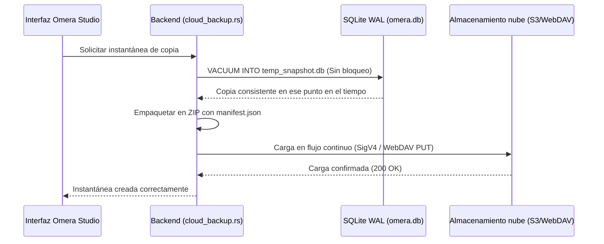

# Copia de instantáneas en la nube y reflejo de medios

Omera incorpora un motor de sincronización delta y copias de respaldo en la nube (`src-tauri/src/cloud_backup.rs` y `src-tauri/src/cloud_sync.rs`) que posibilita copias automatizadas de la base de datos y reflejo incremental de archivos multimedia remotos sin depender de herramientas de terceros.

---

## 1. Proveedores de almacenamiento compatibles

Configure los puntos de enlace remotos en **Preferencias > Copia en la nube**:

| Proveedor | Protocolos y puntos de enlace compatibles | Notas |
| :--- | :--- | :--- |
| **AWS S3 / Compatible** | AWS S3, Cloudflare R2, MinIO, Backblaze B2, Wasabi | Autenticación pura en Rust mediante AWS Signature Version 4 (SigV4) con firmado HMAC-SHA256. |
| **WebDAV** | Nextcloud, ownCloud, Synology DiskStation, NAS QNAP | Autenticación básica HTTP estándar sobre HTTPS. |
| **Directorio local o de red** | Disco local, SSD USB externo, recursos compartidos SMB / NFS | Entrada/salida de archivos directa a alta velocidad sin sobrecarga de protocolos de red. |

---

## 2. Copias de instantáneas SQLite en caliente (`cloud_backup_create_snapshot`)

Omera realiza copias de seguridad de su base de datos utilizando la instrucción nativa `VACUUM INTO` de SQLite:

### Garantías de las instantáneas:
- **Sin bloqueos (Non-Locking)**: Utiliza la API en caliente de SQLite. Puede continuar explorando, calificando y generando imágenes sin interrupciones.
- **Seguridad ante reversiones**: Al restaurar una instantánea, Omera crea automáticamente una copia de seguridad local previa (`omera.db.rollback`) antes de sobreescribir con la copia remota, protegiéndole frente a caídas de red o descargas corruptas.

---

## 3. Reflejo incremental de medios y sincronización delta (`cloud_sync.rs`)

Mientras que las instantáneas aseguran la base de datos, la **Sincronización delta** replica los archivos físicos de imagen y vídeo entre su almacenamiento local y el servidor en la nube.

### Capacidades de sincronización:
- **Estrategias de detección de cambios**:
  - *Huella rápida*: Compara el tamaño del archivo local con la cabecera HTTP ETag remota (la más veloz, perfecta para enlaces lentos).
  - *Suma de comprobación estricta*: Calcula hashes SHA-256 en flujo continuo para asegurar una correspondencia byte por byte absoluta.
- **Limitador de ancho de banda (Token-Bucket)**: Configure un límite de velocidad de subida (KB/s) para que la sincronización en segundo plano no sature el ancho de banda del estudio.
- **Hilos de transferencia concurrentes**: Ajuste el número de subprocesos paralelos (de 1 a 8 hilos).
- **Modo de simulación de prueba (Dry-run)**: Analiza el proceso y reporta qué archivos se subirían, omitirían o eliminarían sin modificar el almacenamiento remoto.
- **Reporte de progreso en tiempo real**: Emite eventos periódicos con los bytes transferidos, velocidad de transmisión, porcentaje completado y tiempo estimado (ETA).
