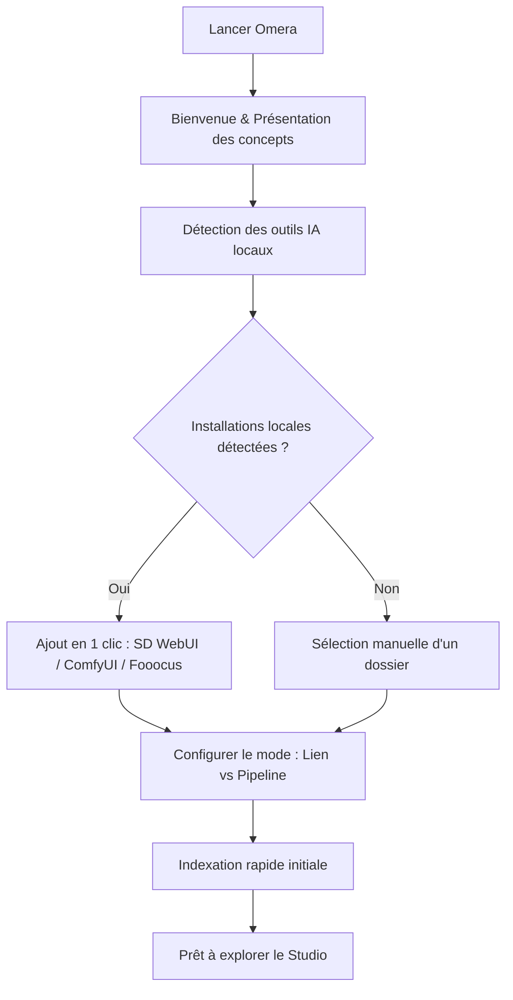

# Installation & Premier démarrage

Ce guide détaille les prérequis système, les plateformes prises en charge, les procédures d'installation et la configuration initiale avec l'assistant de bienvenue pour **Omera**.

---

## 1. Prérequis système

Omera utilise une architecture native ultra-efficace propulsée par **Tauri v2**, **Rust** et **SQLite WAL**. Il fonctionne de manière fluide sur du matériel modeste tout en tirant pleinement parti des stations de travail multicœurs et du stockage NVMe pour les grandes bibliothèques (de 50 000 à plus de 500 000 fichiers).

### Configuration matérielle minimale
- **Processeur (CPU)** : Processeur double cœur x86_64 ou ARM64 (Intel Core i3 / AMD Ryzen 3 / Apple M1 ou plus récent).
- **Mémoire vive (RAM)** : 4 Go de RAM (8 Go ou plus recommandés pour exécuter les modèles locaux ONNX CLIP/WD14).
- **Stockage** : ~150 Mo pour l'installation de l'application ; espace supplémentaire pour les miniatures (cache LRU par défaut configurable de 2 Go) et les fichiers médias.
- **Résolution d'écran** : Fenêtre minimale de 1280 × 800 (adaptable jusqu'à 960 × 640).

### Systèmes d'exploitation pris en charge
| Système d'exploitation | Versions prises en charge | Architecture | Types de paquets |
| :--- | :--- | :--- | :--- |
| **Windows** | Windows 10 (1809+) & Windows 11 | `x86_64` (64 bits) | Installateur standard (`.exe`), Portable (`.zip`) |
| **macOS** | macOS 12 (Monterey) ou ultérieur | `aarch64` (Apple Silicon M1/M2/M3/M4) & `x86_64` (Intel) | Image disque (`.dmg`), Binaire universel |
| **Linux** | Ubuntu 20.04+, Debian 11+, Fedora 36+, Arch Linux | `x86_64` | AppImage (`.AppImage`), Paquet Debian (`.deb`) |

---

## 2. Procédures d'installation

Téléchargez les paquets officiels de production depuis la [page GitHub Releases](https://github.com/BerryUIKI/Omera/releases) ou le [site officiel](https://berryuiki.github.io/Omera/).

### Windows
1. **Installateur standard (`Omera_Windows_x64.exe`)** :
   - Double-cliquez sur le fichier exécutable d'installation.
   - Suivez l'assistant d'installation pour choisir l'emplacement et créer les raccourcis sur le Bureau et dans le menu Démarrer.
   - L'installateur gère automatiquement les raccourcis et enregistre les gestionnaires de protocoles.
2. **Archive portable ZIP (`Omera_Windows_x64.zip`)** :
   - Extrayez l'archive `.zip` sur le disque de votre choix (par exemple, un SSD NVMe externe ou un disque amovible).
   - Lancez `omera.exe` directement sans nécessiter de privilèges d'administrateur.

### macOS
1. Téléchargez l'image disque correspondant à votre processeur :
   - Apple Silicon (M1/M2/M3/M4) : `Omera_macOS_aarch64.dmg`
   - Intel Core : `Omera_macOS_x64.dmg`
2. Ouvrez le fichier `.dmg` et glissez **Omera** dans votre dossier `/Applications`.
3. Les paquets sont signés et notarisés par Apple Gatekeeper. Au premier lancement, démarrez l'application depuis Applications ou Spotlight.

### Linux
1. **AppImage (`Omera_Linux_x64.AppImage`)** :
   - Rendez le binaire exécutable :
     ```bash
     chmod +x Omera_Linux_x64.AppImage
     ./Omera_Linux_x64.AppImage
     ```
2. **Debian / Ubuntu (`Omera_Linux_x64.deb`)** :
   - Installez via `dpkg` ou `apt` :
     ```bash
     sudo dpkg -i Omera_Linux_x64.deb
     sudo apt-get install -f # Résout les éventuelles dépendances webkit2gtk manquantes
     ```

---

## 3. Assistant de bienvenue au premier démarrage

Lorsque vous lancez Omera pour la toute première fois, l'**Assistant de bienvenue** interactif (`OnboardingModal.vue`) s'affiche automatiquement pour vous guider dans la configuration initiale.



### Étapes de l'assistant :
1. **Écran de bienvenue** : Présente les 3 piliers fondamentaux :
   - Indexation locale ultra-rapide avec extraction sans perte des métadonnées de génération.
   - Regroupement intelligent en piles/rafales façon jeu de cartes et comparaison côte à côte.
   - Confidentialité 100 % hors ligne sans aucune télémétrie.
2. **Détection automatique des moteurs IA locaux** :
   - Omera analyse les répertoires locaux usuels sur l'ensemble de vos disques (ex. `C:\`, `D:\`, `/home/`) à la recherche des répertoires de sortie de :
     - **AUTOMATIC1111 / SD.Next** (`outputs/txt2img-images`, `outputs/img2img-images`)
     - **ComfyUI** (`ComfyUI/output`)
     - **Fooocus** (`Fooocus/outputs`)
     - **InvokeAI** (`invokeai/outputs`)
   - S'ils sont détectés, vous pouvez les connecter en un seul clic en tant que **Pipelines AIGC** ou **Liens externes**.
3. **Sélection du mode de stockage** :
   - Choisissez comment Omera interagit avec vos fichiers (en savoir plus dans [Modes de dossiers & Importation](../02-library-management/folder-modes-and-import.md)).
4. **Finalisation** :
   - Omera initialise la base SQLite locale (`omera.db`) en mode Write-Ahead Logging (WAL), démarre l'analyse d'arrière-plan des dossiers et vous dirige directement vers la galerie principale du studio.

---

## 4. Répertoires de données & Stockage de l'application

Omera stocke l'ensemble des index de bibliothèque, caches et fichiers de configuration localement dans votre profil utilisateur :

- **Windows** : `%APPDATA%\com.berryuiki.omera\` (par ex. `C:\Users\<NomUtilisateur>\AppData\Roaming\com.berryuiki.omera\`)
- **macOS** : `~/Library/Application Support/com.berryuiki.omera/`
- **Linux** : `~/.config/com.berryuiki.omera/`

### Contenu du répertoire :
- `omera.db` : Base de données SQLite principale contenant toutes les métadonnées, notes, tags, albums et relations de piles.
- `omera.db-wal` & `omera.db-shm` : Fichiers journaux SQLite en mode WAL.
- `config.json` : Paramètres de l'application (thème, mode d'affichage, résolution des miniatures, URLs d'interopérabilité).
- `thumbnails/` : Cache de miniatures WebP haute performance organisé sous la forme `{file_id}_{mtime}_{edge}.webp`.
- `models/` : Poids de modèles IA ONNX locaux pour CLIP, SigLIP et les étiqueteurs automatiques WD14 Danbooru.

> [!TIP]
> Vous pouvez ouvrir ces répertoires à tout moment depuis **Préférences > Stockage & Info** à l'aide des boutons dédiés « Ouvrir le dossier ».
