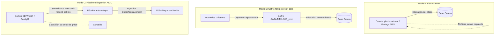

# Importation de médias & Modes de dossiers

Omera offre une architecture de dossiers flexible spécialement pensée pour les flux de travail modernes de génération IA. Plutôt que de vous contraindre à une structure de bibliothèque rigide, Omera prend en charge **trois modes de dossiers distincts**, la récolte automatisée par pipelines et une large variété de formats multimédias.

---

## 1. Les trois modes de dossiers

Lorsque vous ajoutez un dossier (`Fichier > Ajouter un dossier...` ou `Ctrl + O`), vous pouvez choisir le mode qui s'adapte le mieux à votre méthode de travail :



### Mode A : Lien externe (`link`)
- **Fonctionnement** : Indexation sur place, sans copie de fichiers.
- **Idéal pour** : Les partages réseau NAS existants (SMB/NFS), les disques durs externes ou les collections d'archives en lecture seule que vous ne souhaitez ni déplacer ni réorganiser.
- **Comportement** : Omera extrait les métadonnées et génère des miniatures rapides, tout en laissant les fichiers physiques exactement là où ils se trouvent sur le disque.

### Mode B : Coffre-fort de projet géré (`managed`)
- **Fonctionnement** : Référentiel dédié et organisé au sein de l'application.
- **Idéal pour** : Les bibliothèques personnelles triées sur le volet ou les portfolios de studio pour lesquels vous désirez une racine de stockage propre et unifiée.
- **Comportement** : Lorsque vous glissez ou importez des fichiers dans un Coffre-fort géré, Omera les organise automatiquement dans une arborescence physique découpée par date :
  ```
  <Racine_du_Coffre>/
  └── 2026/
      └── 09/
          ├── 550e8400-e29b-41d4-a716-446655440000_cyberpunk_01.png
          └── 6ba7b810-9dad-11d1-80b4-00c04fd430c8_portrait_02.webp
  ```

### Mode C : Pipeline d'ingestion AIGC (`pipeline`)
- **Fonctionnement** : Surveillance active et récolte automatisée des répertoires de sortie des générateurs d'IA.
- **Idéal pour** : Se connecter directement aux dossiers de sortie de **AUTOMATIC1111 / SD.Next**, **ComfyUI**, **Fooocus** ou **InvokeAI**.
- **Mécanismes du pipeline** :
  1. **Anti-rebond du verrouillage en écriture (Write-Lock Debouncing)** : Lorsqu'un générateur écrit un fichier PNG ou MP4 volumineux sur le disque, sa taille varie pendant l'écriture. L'observateur de Omera vérifie la stabilité de la taille du fichier pendant **500 ms** avant toute opération, évitant ainsi d'ingérer des images corrompues à moitié générées.
  2. **Comportement d'ingestion** : Choisissez entre **Copier** (duplique le fichier dans votre bibliothèque) et **Déplacer** (transfère directement les nouvelles créations terminées dans Omera).
  3. **Récolte automatique & Nettoyage différé** : Vous pouvez définir un délai de grâce pour le répertoire source du générateur (`Immédiat`, `1 heure`, `24 heures`, `3 jours`, `7 jours`, `Jamais`). Une fois ce délai écoulé, les fichiers de sortie traités sont déplacés en toute sécurité vers la **corbeille de votre système**, gardant ainsi votre disque de génération propre sans risquer de perdre des données.

---

## 2. Formats de fichiers & Médias pris en charge

Omera analyse les en-têtes de conteneurs et les flux binaires à l'aide de moteurs d'analyse natifs écrits en Rust (`omera-metadata`), en inspectant les octets magiques plutôt qu'en se fiant uniquement aux extensions de fichiers :

| Conteneur | Extensions | En-tête magique | Capacités d'extraction de métadonnées de génération |
| :--- | :--- | :--- | :--- |
| **PNG** | `.png` | `\x89PNG\r\n\x1a\n` | Blocs complets PNGInfo : `parameters` (A1111), `prompt` & `workflow` (ComfyUI), `Comment` (NovelAI), `invokeai_metadata`, `sui_image_params`. |
| **WebP** | `.webp` | `RIFF....WEBP` | Blocs de métadonnées EXIF intégrés, segments de chunks WebP ComfyUI. |
| **JPEG** | `.jpg`, `.jpeg` | `\xFF\xD8\xFF` | Segments intégrés EXIF APP1 (`UserComment`, `ImageDescription`, `Software`). |
| **MP4** | `.mp4` | Boîte `ftyp` à l'octet 4 | Analyse des boîtes ISOBMFF (`moov/udta` avec JSON ComfyUI intégré, durée, fréquence d'images FPS, codecs vidéo). |
| **WebM** | `.webm` | `\x1A\x45\xDF\xA3` (EBML) | Propriétés du flux vidéo EBML, dimensions des images et métadonnées annexes. |
| **Fichiers auxiliaires (Sidecars)** | `.txt`, `.json` | Texte brut / JSON | Fichiers d'accompagnement chargés automatiquement si les métadonnées internes font défaut. |
| **Civitai** | `.civitai.info` | Format JSON | Associe automatiquement le hash du modèle, les mots déclencheurs et les images d'aperçu pour les checkpoints LoRA. |

---

## 3. Indexation incrémentielle & Surveillance du système de fichiers

Omera évite les parcours de disque complets et fastidieux au démarrage :

1. **Vérification d'empreinte rapide** :
   - Les fichiers sont suivis dans SQLite au moyen d'un index composite ultra-léger : `(path, size_bytes, modified_at)`.
   - Au démarrage ou lors d'une nouvelle analyse, Omera compare l'horodatage et la taille enregistrés en cache. Les fichiers identiques sont ignorés instantanément sans nécessiter de lecture sur le disque ni d'analyse du JSON de métadonnées.
2. **Journalisation durable des modifications** :
   - Les événements issus de l'observateur du système de fichiers (`notify` v8) font l'objet d'un filtre anti-rebond d'une **période d'inactivité de 750 ms** et sont consignés dans SQLite (`filesystem_change_journal`).
   - Même si vous produisez 1 000 images lors d'une génération intensive par lots, Omera regroupe les événements par paquets de 1 024, évitant les ralentissements de l'interface et la contention des verrous de base de données.
3. **Délai entre les analyses au démarrage** :
   - Dans **Préférences > Général**, vous pouvez configurer l'intervalle d'analyse au démarrage (par défaut : **360 minutes / 6 heures**). Omera affiche l'intégralité de votre bibliothèque existante depuis SQLite en moins de 50 ms à l'ouverture, différant la réconciliation complète sur le disque jusqu'à ce que ce soit nécessaire.
