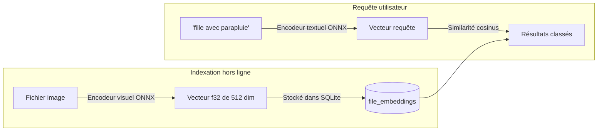

# Recherche sémantique IA & Étiquetage automatique

Omera intègre des moteurs d'inférence IA locaux pour la **Recherche sémantique en langage naturel** (`omera-clip`) et l'**Étiquetage automatique anime/esthétique** (`omera-tagger`). Tous les modèles s'exécutent à 100 % localement sur votre poste de travail via ONNX Runtime sans envoyer d'images ni de prompts vers des services cloud externes.

---

## 1. Recherche sémantique en langage naturel (`omera-clip`)

La recherche traditionnelle dans les métadonnées ne trouve des images que si le terme exact était explicitement écrit dans le prompt de génération. La **Recherche sémantique** vous permet de décrire l'aspect visuel ou le concept d'une œuvre en langage naturel (ex. *« fille sous la pluie avec parapluie la nuit »*), et Omera identifiera les images correspondantes en analysant leur sens visuel.

### Configurer la recherche sémantique
1. Cliquez sur **Outils > Index sémantique CLIP...** pour ouvrir la fenêtre de gestion (`ClipManagerModal.vue`).
2. Omera analyse votre dossier `models/` à la recherche des modèles ONNX CLIP/SigLIP compatibles (encodeur visuel, encodeur textuel, tokenizer).
3. Cliquez sur **« Indexer les images restantes »** : Omera calcule les vecteurs d'incorporation (embeddings) visuels normalisés au moyen de threads d'arrière-plan et enregistre les vecteurs obtenus dans la table SQLite `file_embeddings` (Schéma v7).
4. **Effectuer une recherche** :
   - Dans la barre de recherche principale, cliquez sur l'icône de cerveau (`🧠`) pour basculer en **Mode sémantique**.
   - Saisissez n'importe quelle phrase en langage naturel et appuyez sur `Entrée`.
   - Les résultats s'affichent dans la galerie classés par proximité cosinus visuelle.

---

## 2. Recherche par similarité visuelle (Image-vers-Image)

Vous pouvez rechercher des images visuellement ou stylistiquement proches directement à partir de n'importe quelle création existante :
1. Faites un clic droit sur une image ou cliquez sur **« Trouver des images similaires »** dans l'Inspecteur.
2. Omera extrait le vecteur d'incorporation stocké pour cette image et interroge la base de données pour trouver ses plus proches voisins par distance cosinus.
3. La galerie bascule en **Vue de similarité visuelle**, affichant le pourcentage de correspondance (ex. `Correspondance : 96 %`) avec un curseur interactif de seuil de similarité (de 0 % à 95 %).

---

## 3. Étiqueteur automatique Anime WD14 / Danbooru (`omera-tagger`)

Si votre bibliothèque contient des images issues de NovelAI, de checkpoints anime (Animagine, NAI, Anything) ou des créations sans métadonnées, l'**Étiqueteur WD14** intégré (`AutoTagModal.vue`) peut détecter et assigner automatiquement les tags Danbooru.

### Architectures de modèles prises en charge :
- Modèles ONNX **SwinV2**, **ConvNeXt**, **ViT** et **MOAT**.
- Associés aux fichiers de taxonomie `selected_tags.csv`.

### Classification des tags & Seuils :
L'étiqueteur classe les prédictions en trois groupes distincts :
1. **Tags généraux** (ex. `1girl`, `blue eyes`, `looking at viewer`, `cherry blossoms`).
   - Seuil de confiance par défaut : `0.35` (configurable).
2. **Tags de personnages** (identifie les personnages spécifiques d'anime ou de jeu vidéo).
   - Seuil de confiance par défaut : `0.85` (un seuil élevé prévient les faux positifs).
3. **Tags de classification** (`general`, `sensitive`, `questionable`, `explicit`).
   - Utilisés pour définir automatiquement l'indicateur de contenu sensible (`is_nsfw`).

### Étiquetage par lots :
- Sélectionnez plusieurs images dans la galerie, cliquez sur **« Étiquetage auto »** dans la barre d'actions flottante, réglez vos seuils de confiance, et Omera traitera le lot en arrière-plan en appliquant automatiquement les tags correspondants dans votre bibliothèque.
