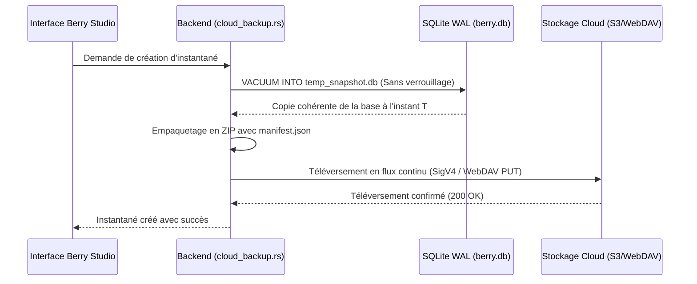

# Sauvegarde d'instantanés Cloud & Miroir multimédia

Berry AI Studio intègre un moteur de sauvegarde cloud et de synchronisation différentielle delta (`src-tauri/src/cloud_backup.rs` et `src-tauri/src/cloud_sync.rs`) qui permet des sauvegardes automatisées de base de données et la mise en miroir incrémentielle des fichiers médias distants, sans recourir à des outils tiers.

---

## 1. Fournisseurs de stockage pris en charge

Configurez vos points de terminaison distants dans **Préférences > Sauvegarde Cloud** :

| Fournisseur | Protocoles & Points de terminaison pris en charge | Remarques |
| :--- | :--- | :--- |
| **AWS S3 / Compatible** | AWS S3, Cloudflare R2, MinIO, Backblaze B2, Wasabi | Authentification native en Rust avec AWS Signature Version 4 (SigV4) signée en HMAC-SHA256. |
| **WebDAV** | Nextcloud, ownCloud, Synology DiskStation, QNAP NAS | Authentification HTTP Basic standard sur HTTPS. |
| **Chemin local / Réseau** | Disque local, SSD externe USB, partages réseau SMB / NFS | Entrées/sorties directes haute performance sur le système de fichiers sans surcharge protocolaire réseau. |

---

## 2. Sauvegarde d'instantanés SQLite à chaud (`cloud_backup_create_snapshot`)

Berry effectue la sauvegarde de votre base de données à l'aide de l'instruction native SQLite `VACUUM INTO` :

### Garanties des instantanés :
- **Sans interruption (Non-Locking)** : Utilise l'API de vacuum en ligne de SQLite. Vous pouvez continuer à parcourir, noter et générer des images sans aucune interruption de service.
- **Sécurité de restauration (Rollback)** : Lors de la restauration d'un instantané distant, Berry génère automatiquement une copie locale de secours (`berry.db.rollback`) avant d'appliquer la sauvegarde distante, prévenant toute coupure réseau ou corruption de téléchargement.

---

## 3. Miroir multimédia incrémentiel & Synchronisation Delta (`cloud_sync.rs`)

Tandis que les instantanés sécurisent votre base de données, la **Synchronisation Delta** met en miroir vos fichiers physiques d'images et de vidéos entre votre disque local et votre stockage cloud distant.

### Fonctionnalités de synchronisation :
- **Stratégies de détection des modifications** :
  - *Empreinte rapide* : Compare la taille du fichier local et l'ETag HTTP distant (la plus rapide, idéale pour les connexions modérées).
  - *Somme de contrôle stricte* : Calcule des sommes SHA-256 en continu pour certifier la conformité octet par octet.
- **Limiteur de bande passante par seau de jetons** : Fixez un plafond de vitesse d'envoi (Ko/s) afin que la synchronisation d'arrière-plan ne sature pas la bande passante de votre studio.
- **Concurrence des workers** : Configurez le nombre de threads d'envoi simultanés (de 1 à 8 threads).
- **Mode simulation (Dry-Run)** : Simule l'exécution de la synchronisation et indique les fichiers à téléverser, à ignorer ou à supprimer sans modifier le stockage distant.
- **Suivi de progression en temps réel** : Émet des événements réguliers indiquant les octets transférés, le débit, le pourcentage achevé et le temps estimé restant.
