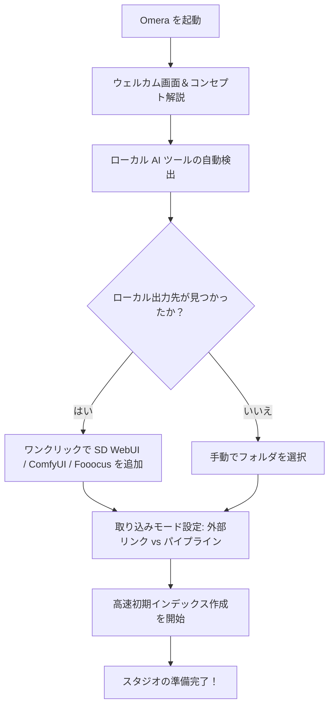

# インストールと初期起動

本ガイドでは、**Omera** のシステム要件、対応プラットフォーム、インストール手順、および初回起動時の初期設定ウィザードについて詳しく解説します。

---

## 1. システム要件

Omera は、**Tauri v2**、**Rust**、および **SQLite WAL** を基盤とした超高効率なネイティブアーキテクチャを採用しています。一般的なハードウェアでも軽快に動作し、大規模ライブラリ（5万〜50万枚以上）を扱う環境ではマルチコアワークステーションや NVMe ストレージの性能を最大限に引き出します。

### 最小ハードウェア要件
- **CPU**: デュアルコア x86_64 または ARM64 プロセッサ（Intel Core i3 / AMD Ryzen 3 / Apple M1 以降）。
- **RAM**: 4 GB RAM（ローカル CLIP / WD14 ONNX モデルを実行する場合は 8 GB 以上を推奨）。
- **ストレージ**: アプリケーション本体のインストール用に約 150 MB。サムネイルキャッシュ（既定値 2 GB の LRU キャッシュ、設定変更可能）およびメディアファイル用の追加空き容量。
- **ディスプレイ解像度**: 1280 × 800 以上のビューポート（960 × 640 までのレスポンシブ縮小表示に対応）。

### 対応オペレーティングシステム
| OS | 対応バージョン | アーキテクチャ | 配布パッケージ形式 |
| :--- | :--- | :--- | :--- |
| **Windows** | Windows 10 (1809以降) & Windows 11 | `x86_64` (64-bit) | 標準インストーラー (`.exe`), ポータブル版 (`.zip`) |
| **macOS** | macOS 12 (Monterey) 以降 | `aarch64` (Apple Silicon M1/M2/M3/M4) & `x86_64` (Intel) | ディスクイメージ (`.dmg`), Universal バイナリ |
| **Linux** | Ubuntu 20.04+, Debian 11+, Fedora 36+, Arch Linux | `x86_64` | AppImage (`.AppImage`), Debian パッケージ (`.deb`) |

---

## 2. インストール手順

公式リリースパッケージは、[GitHub Releases ページ](https://github.com/BerryUIKI/Omera/releases) または [公式ウェブサイト](https://berryuiki.github.io/Omera/) からダウンロードできます。

### Windows
1. **標準インストーラー (`Omera_Windows_x64.exe`)**:
   - インストーラーの実行ファイルをダブルクリックします。
   - セットアップウィザードに従い、インストール先フォルダの指定やデスクトップ／スタートメニューのショートカット作成を行います。
   - インストーラーがデスクトップショートカットおよびプロトコルハンドラーの登録を自動処理します。
2. **ポータブル ZIP 版 (`Omera_Windows_x64.zip`)**:
   - `.zip` アーカイブを任意のドライブ（外付け NVMe SSD やポータブルストレージなど）に展開します。
   - 管理者権限不要で `omera.exe` を直接起動して利用できます。

### macOS
1. 使用している CPU に適したディスクイメージをダウンロードします：
   - Apple Silicon (M1/M2/M3/M4): `Omera_macOS_aarch64.dmg`
   - Intel Core: `Omera_macOS_x64.dmg`
2. `.dmg` ファイルを開き、**Omera** を `/Applications`（アプリケーション）フォルダにドラッグ＆ドロップします。
3. パッケージは Apple Gatekeeper によるコード署名・公証済みです。初回起動時は Applications または Spotlight から起動してください。

### Linux
1. **AppImage (`Omera_Linux_x64.AppImage`)**:
   - 実行権限を付与します：
     ```bash
     chmod +x Omera_Linux_x64.AppImage
     ./Omera_Linux_x64.AppImage
     ```
2. **Debian / Ubuntu (`Omera_Linux_x64.deb`)**:
   - `dpkg` または `apt` でインストールします：
     ```bash
     sudo dpkg -i Omera_Linux_x64.deb
     sudo apt-get install -f # 不足している webkit2gtk 依存関係を解決
     ```

---

## 3. 初回起動時の初期設定ウィザード

Omera を初めて起動すると、インタラクティブな **初期設定ウィザード**（`OnboardingModal.vue`）が自動的に開き、セットアップを案内します。



### ウィザードの手順：
1. **ウェルカム画面**: 3つのコア機能を紹介します：
   - 生成メタデータを可逆抽出する高速ローカルインデックス。
   - トランプ風スタックによるインテリジェントなバーストグループ化と並列比較。
   - テレメトリ送信ゼロの 100% 完全オフラインプライバシー保護。
2. **ローカル AI 生成ツールの自動検出**:
   - Omera は全ドライブ（`C:\`、`D:\`、`/home/` など）の一般的な出力フォルダをスキャンし、以下を自動検出します：
     - **AUTOMATIC1111 / SD.Next** (`outputs/txt2img-images`, `outputs/img2img-images`)
     - **ComfyUI** (`ComfyUI/output`)
     - **Fooocus** (`Fooocus/outputs`)
     - **InvokeAI** (`invokeai/outputs`)
   - 検出された場合、ワンクリックで **AIGC 取り込みパイプライン** または **外部リンク** として登録できます。
3. **ストレージモードの選択**:
   - Omera がファイルをどのように扱うかを選択します（詳細は [フォルダモードとインポート](../02-library-management/folder-modes-and-import.md) を参照）。
4. **初期化完了**:
   - ローカル SQLite データベース（`omera.db`）が WAL モードで初期化され、バックグラウンドでのフォルダスキャンが開始されてメインスタジオギャラリーに移動します。

---

## 4. アプリケーションストレージとデータ保存ディレクトリ

Omera は、すべてのライブラリインデックス、キャッシュ、環境設定をユーザープロファイル内にローカル保存します：

- **Windows**: `%APPDATA%\com.berryuiki.omera\` (例: `C:\Users\<User>\AppData\Roaming\com.berryuiki.omera\`)
- **macOS**: `~/Library/Application Support/com.berryuiki.omera/`
- **Linux**: `~/.config/com.berryuiki.omera/`

### ディレクトリの内容構成：
- `omera.db`: すべてのメタデータ、評価、タグ、アルバム、スタック関連情報を保持するメインの SQLite データベース。
- `omera.db-wal` & `omera.db-shm`: SQLite WAL ジャーナルファイル。
- `config.json`: アプリケーション設定ファイル（テーマ、表示モード、サムネイル解像度、生成ツール連携 URL など）。
- `thumbnails/`: `{file_id}_{mtime}_{edge}.webp` 形式で管理される高効率 WebP サムネイルキャッシュ。
- `models/`: CLIP、SigLIP、WD14 Danbooru 自動タガー用のローカル ONNX AI モデルファイル。

> [!TIP]
> **環境設定 > ストレージと情報** にある「フォルダを開く」ボタンから、いつでもこれらのディレクトリを直接開くことができます。
