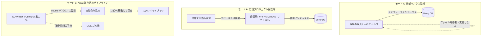

# メディアのインポートとフォルダモード

Berry AI Studio は、現代の AI 生成ワークフローに合わせて最適化された柔軟なフォルダアーキテクチャを提供します。単一の固定されたライブラリ構造を強制するのではなく、**3種類のフォルダモード**、パイプラインによる自動取り込み、および多彩なメディアフォーマットに対応しています。

---

## 1. 3つのフォルダモード

フォルダを追加する際（`ファイル > フォルダを追加...` または `Ctrl + O`）、作業スタイルに応じた最適なモードを選択できます：



### モード A: 外部リンクと監視 (`link`)
- **動作の仕組み**: インプレース・ゼロコピーインデックス。
- **最適な用途**: 既存の NAS 共有フォルダ（SMB/NFS）、外付けハードディスク、または Berry 側でファイルを移動・整理したくない大規模な読み取り専用アーカイブコレクション。
- **特徴**: Berry はメタデータの抽出とサムネイルの高速生成のみを行い、ディスク上の物理ファイルには一切触れず元の位置のまま保持します。

### モード B: 管理プロジェクト保管庫 (`managed`)
- **動作の仕組み**: アプリケーション専用の整理された構造化リポジトリ。
- **最適な用途**: 個人作品の厳選ライブラリや、統一されたストレージルートで一元管理したいスタジオポートフォリオ。
- **特徴**: ファイルを管理保管庫（Vault）へドラッグ＆ドロップまたはインポートすると、Berry は以下のような日付ベースのディレクトリ構造にファイルを自動配置・整理します：
  ```
  <Vault_Root>/
  └── 2026/
      └── 09/
          ├── 550e8400-e29b-41d4-a716-446655440000_cyberpunk_01.png
          └── 6ba7b810-9dad-11d1-80b4-00c04fd430c8_portrait_02.webp
  ```

### モード C: ⚡ AIGC 取り込みパイプライン (`pipeline`)
- **動作の仕組み**: AI 生成ツールの出力ディレクトリをアクティブ監視し、自動取り込みと整理を実行。
- **最適な用途**: ローカルの **AUTOMATIC1111 / SD.Next**、**ComfyUI**、**Fooocus**、**InvokeAI** の出力フォルダとの直接連携。
- **パイプラインのメカニズム**:
  1. **書き込み完了のデバウンス判定**: 生成ツールが巨大な PNG や MP4 をディスクに書き込んでいる間、ファイルサイズは変動します。Berry のウォッチャーはファイルサイズの変動が止まり **500 ms** 安定するのを確認してから処理を開始し、生成途中の壊れた画像を取り込むのを防ぎます。
  2. **取り込み時の動作**: **コピー**（元画像を出力フォルダに残したまま保管庫へ複製）または **移動**（新規生成された画像を保管庫へ直接移動）を選択できます。
  3. **自動取り込みと遅延クリーンアップ**: 生成元フォルダの削除猶予期間（`即時`、`1時間`、`24時間`、`3日`、`7日`、`無制限`）を設定可能です。猶予期間が経過すると、処理済みの元ファイルは安全に **OS のゴミ箱** へ移動されるため、データ消失のリスクなく生成ドライブの空き容量を常に確保できます。

---

## 2. 対応ファイルおよびメディア形式

Berry AI Studio は、拡張子だけに依存せず、Rust ネイティブのパーサー（`berry-metadata`）でマジックバイトを判定して各種コンテナヘッダーとバイナリストリームを解析します：

| コンテナ | 拡張子 | ヘッダー識別バイト | AIGC 生成メタデータ対応 |
| :--- | :--- | :--- | :--- |
| **PNG** | `.png` | `\x89PNG\r\n\x1a\n` | 完全な PNGInfo チャンク解析: `parameters` (A1111), `prompt` & `workflow` (ComfyUI), `Comment` (NovelAI), `invokeai_metadata`, `sui_image_params`。 |
| **WebP** | `.webp` | `RIFF....WEBP` | 埋め込み EXIF メタデータブロック、ComfyUI WebP チャンクデータ。 |
| **JPEG** | `.jpg`, `.jpeg` | `\xFF\xD8\xFF` | 埋め込み EXIF APP1 セグメント (`UserComment`, `ImageDescription`, `Software`)。 |
| **MP4** | `.mp4` | オフセット4 の `ftyp` ボックス | ISOBMFF ボックス解析（`moov/udta` に埋め込まれた ComfyUI JSON、再生時間、FPS、ビデオコーデック）。 |
| **WebM** | `.webm` | `\x1A\x45\xDF\xA3` (EBML) | EBML ビデオストリーム情報、解像度、サイドカーメタデータ。 |
| **サイドカー** | `.txt`, `.json` | プレーンテキスト / JSON | 埋め込みチャンクが存在しない場合に自動読み込みされる同名コンパニオンファイル。 |
| **Civitai** | `.civitai.info` | JSON 形式 | LoRA チェックポイントのモデルハッシュ、トリガーワード、プレビュー画像の自動関連付け。 |

---

## 3. 増分インデックスとファイルシステム監視

Berry AI Studio は、起動時の低速なフルディスク走査を回避する設計になっています：

1. **フィンガープリント検証**:
   - ファイルは SQLite 内で `(path, size_bytes, modified_at)` の軽量な複合インデックスにより追跡されます。
   - アプリ起動時や再スキャン時、キャッシュされた更新日時とファイルサイズを即座に比較します。一致するファイルはファイル内容の読み込みや JSON 解析を行わずにスキップされます。
2. **堅牢な変更ジャーナリング**:
   - ファイルシステムの変更イベント（`notify` v8）は **750 ms のクワイエット期間** でデバウンス処理され、SQLite（`filesystem_change_journal`）に書き込まれます。
   - 高速バッチ生成で 1,000 枚の画像が一気に生成された場合でも、イベントは 1,024 件ごとのチャンクにバッチ化され、UI のもたつきやデータベースのロック競合を防ぎます。
3. **起動スキャン間隔の制御**:
   - **環境設定 > 一般設定** で、起動時スキャンの間隔（デフォルト: **360分 / 6時間**）を設定できます。Berry は起動時に SQLite から 50 ms 未満で既存ライブラリを描画し、ディスク全体の同期走査は必要なときまで遅延させます。
