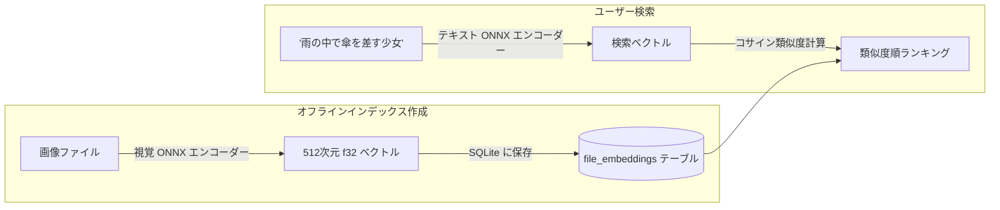

# AI セマンティック検索と自動タグ付け

Berry AI Studio は、**自然言語セマンティック検索**（`berry-clip`）および **アニメ／審美自動タグ付け**（`berry-tagger`）のためのローカル AI 推論エンジンを内蔵しています。すべてのモデルは ONNX Runtime を通じて PC 上で 100% 完全ローカルに実行され、画像やプロンプトが外部のクラウド API に送信されることは一切ありません。

---

## 1. 自然言語セマンティック検索 (`berry-clip`)

従来のメタデータ検索では、生成時のプロンプトに含まれる完全一致のキーワードしか検索できませんでした。**セマンティック検索** を使用すると、「雨の夜に傘を差す少女」のような自然な文章で作品の情景を描写するだけで、概念的な視覚的類似性に基づいて合致する画像を検索できます。

### セマンティック検索のセットアップ
1. 上部メニューの **ツール > CLIPセマンティック検索インデックス...** をクリックして管理モーダル（`ClipManagerModal.vue`）を開きます。
2. Berry は `models/` ディレクトリをスキャンし、互換性のある CLIP / SigLIP ONNX モデル（視覚エンコーダー、テキストエンコーダー、トークナイザー）を検出します。
3. **「未処理画像のインデックス作成を開始」** をクリックします。バックグラウンドワーカースレッドが画像の正規化特徴量ベクトルを計算し、SQLite の `file_embeddings` テーブル（スキーマ v7）に保存します。
4. **検索の実行**:
   - メイン検索バーで脳のアイコン（`🧠`）をクリックして **セマンティック検索モード** に切り替えます。
   - 自然言語のフレーズを入力して `Enter` キーを押します。
   - ギャラリー内に、視覚的なコサイン類似度順にソートされた作品が瞬時に表示されます。

---

## 2. 画像間ビジュアル類似度検索 (Image-to-Image)

既存の画像から、構図やスタイルが似ている画像を直接探すことができます：
1. 任意の画像を右クリックするか、インスペクター内の **「類似画像を検索」** をクリックします。
2. Berry はその画像の保存済み特徴量ベクトルを取得し、コサイン距離を用いてデータベースから最も近い画像を抽出します。
3. ギャラリーが **類似画像検索マッチビュー** に切り替わり、類似度パーセント（例: `96% 類似`）とインタラクティブなしきい値スライダー（0%〜95%）が表示されます。

---

## 3. WD14 / Danbooru アニメ自動タガー (`berry-tagger`)

ライブラリ内に NovelAI や各種アニメチェックポイント（Animagine、NAI、Anything など）で生成された画像、あるいはメタデータのない作品が含まれている場合、内蔵の **WD14 自動タガー**（`AutoTagModal.vue`）を使用して Danbooru タグを自動検出・付与できます。

### 対応モデルアーキテクチャ：
- **SwinV2**, **ConvNeXt**, **ViT**, **MOAT** の各種 ONNX モデル。
- `selected_tags.csv` タクソノミーファイルとのペア。

### タグの分類としきい値設定：
タガーは予測結果を3つのカテゴリに分類します：
1. **一般タグ (General Tags)**: 描写内容に関するタグ（例: `1girl`, `blue eyes`, `looking at viewer`, `cherry blossoms`）。
   - デフォルトの信頼度しきい値: `0.35`（調整可能）。
2. **キャラクタータグ (Character Tags)**: 特定のアニメ／ゲームの登場キャラクター名を特定。
   - デフォルトの信頼度しきい値: `0.85`（誤判定を防ぐため高めに設定）。
3. **レーティングタグ (Rating Tags)**: コンテンツの年齢制限（`general`, `sensitive`, `questionable`, `explicit`）。
   - センシティブ設定フラグ（`is_nsfw`）を自動付与するために使用。

### 一括自動タグ付け：
- ギャラリーで複数画像を選択し、下部の一括アクションバーで **「自動タグ」** をクリックします。信頼度しきい値を設定して実行すると、バックグラウンドで一括推論が行われ、カラータグがライブラリに自動登録されます。
