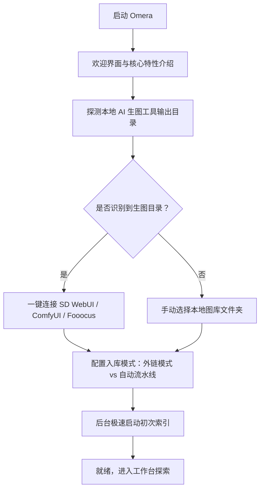

# 安装与首次启动

本指南将详细介绍 **Omera** 的系统配置要求、支持平台、安装步骤以及首次启动欢迎配置向导。

---

## 1. 系统配置要求

Omera 采用由 **Tauri v2**、**Rust** 和 **SQLite WAL** 强力驱动的超高效原生底层架构。在基础办公硬件上能够轻盈流畅运行，同时可充分榨干多核工作站与高速 NVMe 固态硬盘的性能，轻松驾驭 5 万至 50 万+ 规模的大型本地图库。

### 最低硬件要求
- **处理器 (CPU)**：双核 x86_64 或 ARM64 处理器（Intel Core i3 / AMD Ryzen 3 / Apple M1 或更新型号）。
- **内存 (RAM)**：4 GB 内存（推荐 8 GB 以上，以便流畅运行本地 CLIP/WD14 ONNX 深度学习模型）。
- **存储空间**：约 150 MB 用于安装应用程序；另需预留磁盘空间用于存储缩略图（默认提供 2 GB 可调配的 LRU 缓存预算）及原始媒体文件。
- **显示分辨率**：最低 1280 × 800 视口（最小可响应式自适应缩减至 960 × 640）。

### 支持的操作系统
| 操作系统 | 支持版本 | 架构 | 安装包类型 |
| :--- | :--- | :--- | :--- |
| **Windows** | Windows 10 (1809+) 与 Windows 11 | `x86_64` (64 位) | 标准安装包 (`.exe`)、免安装便携版 (`.zip`) |
| **macOS** | macOS 12 (Monterey) 或更高版本 | `aarch64` (Apple Silicon M1/M2/M3/M4) 与 `x86_64` (Intel) | 磁盘映像 (`.dmg`)、通用二进制 (Universal Binary) |
| **Linux** | Ubuntu 20.04+、Debian 11+、Fedora 36+、Arch Linux | `x86_64` | AppImage 独立包 (`.AppImage`)、Debian 软件包 (`.deb`) |

---

## 2. 安装步骤指南

你可以从官方 [GitHub Releases 页面](https://github.com/BerryUIKI/Omera/releases) 或 [官方网站](https://berryuiki.github.io/Omera/) 下载正式版安装程序。

### Windows 系统
1. **标准安装包 (`Omera_Windows_x64.exe`)**：
   - 双击运行安装程序可执行文件。
   - 按照安装向导提示选择安装目录，并自动生成桌面和开始菜单快捷方式。
   - 安装程序会自动注册必要的文件关联协议与桌面集成。
2. **免安装便携包 (`Omera_Windows_x64.zip`)**：
   - 将 `.zip` 压缩包直接解压至指定磁盘（如高速移动固态硬盘或扩展盘）。
   - 无需管理员权限，直接双击运行 `omera.exe` 即可启动。

### macOS 系统
1. 根据你的 Mac 芯片架构下载对应磁盘映像：
   - Apple Silicon 芯片 (M1/M2/M3/M4)：`Omera_macOS_aarch64.dmg`
   - Intel Core 处理器：`Omera_macOS_x64.dmg`
2. 双击打开 `.dmg` 挂载文件，将 **Omera** 拖动至 `/Applications`（应用程序）文件夹。
3. 官方安装包已通过 Apple Gatekeeper 签名公证。初次启动时，从访达“应用程序”或聚焦搜索（Spotlight）启动即可。

### Linux 系统
1. **AppImage 绿色运行包 (`Omera_Linux_x64.AppImage`)**：
   - 赋予可执行权限后直接启动：
     ```bash
     chmod +x Omera_Linux_x64.AppImage
     ./Omera_Linux_x64.AppImage
     ```
2. **Debian / Ubuntu 软件包 (`Omera_Linux_x64.deb`)**：
   - 使用 `dpkg` 或 `apt` 完成安装：
     ```bash
     sudo dpkg -i Omera_Linux_x64.deb
     sudo apt-get install -f # 自动补全可能缺失的 webkit2gtk 系统依赖
     ```

---

## 3. 首次启动欢迎配置向导

当首次启动 Omera 时，交互式**欢迎配置向导**（`OnboardingModal.vue`）将自动弹出，引导你快速完成初始环境配置。



### 欢迎向导核心步骤：
1. **欢迎概览**：介绍产品的三大基石能力：
   - 亚毫秒级高速本地索引与全方位生成元数据无损提取。
   - 智能扑克牌连拍堆叠聚合与双图并排深度比对。
   - 100% 离线保护与零数据遥测上传。
2. **本地 AI 引擎自动探测**：
   - Omera 会自动扫描系统常用磁盘（如 `C:\`、`D:\`、`/home/` 等）中常见的生图输出目录：
     - **AUTOMATIC1111 / SD.Next** (`outputs/txt2img-images`、`outputs/img2img-images`)
     - **ComfyUI** (`ComfyUI/output`)
     - **Fooocus** (`Fooocus/outputs`)
     - **InvokeAI** (`invokeai/outputs`)
   - 识别成功后，只需轻轻一点即可将它们连接为 **AIGC 自动流水线**或**外部只读引用**。
3. **选择存储管理模式**：
   - 挑选适合你工作流的媒体库接管方式（详见[文件夹模式与媒体导入](../02-library-management/folder-modes-and-import.md)）。
4. **初始化完成**：
   - Omera 在后台以预写日志模式（WAL）初始化本地 SQLite 数据库（`omera.db`），启动非阻塞式目录扫描，并立即带你进入主画廊界面。

---

## 4. 应用程序存储与本地数据目录

Omera 将所有的媒体元数据索引、缩略图缓存以及偏好配置文件均安全妥善地保存在当前操作系统的用户数据目录中：

- **Windows**：`%APPDATA%\com.berryuiki.omera\`（例如：`C:\Users\<User>\AppData\Roaming\com.berryuiki.omera\`）
- **macOS**：`~/Library/Application Support/com.berryuiki.omera/`
- **Linux**：`~/.config/com.berryuiki.omera/`

### 目录核心结构剖析：
- `omera.db`：核心 SQLite 数据库，保存所有图像元数据、评分、标签、相册索引及堆叠关联关系。
- `omera.db-wal` 与 `omera.db-shm`：SQLite 预写日志与共享内存缓存文件。
- `config.json`：软件偏好配置（界面主题、默认视图、缩略图规格、生图工具 API 地址等）。
- `thumbnails/`：超高性能 WebP 缩略图本地缓存，文件命名规则为 `{file_id}_{mtime}_{edge}.webp`。
- `models/`：本地 ONNX AI 模型权重目录（存放 CLIP、SigLIP 文本向量模型以及 WD14 Danbooru 自动打标模型）。

> [!TIP]
> 你可以随时在**首选项设置 > 关于与存储**面板中，点击专用的“打开所在目录”按钮，直接一键唤起文件管理器访问上述路径。
