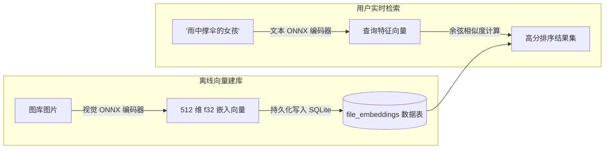

# AI 语义搜索与自动打标

Berry AI Studio 内置了完全本地化的轻量级 AI 深度学习推理引擎，用于实现**自然语言文本语义搜图**（`berry-clip`）以及**动漫/美学图像自动打标**（`berry-tagger`）。所有模型均通过 ONNX Runtime 在本机 GPU/CPU 上纯离线高速运行，绝不向任何外部云端或第三方服务器上传你的图片或提示词。

---

## 1. 自然语言文本语义搜图 (`berry-clip`)

传统的提示词元数据搜索，只有当用户的检索词恰好出现在当时跑图的 Prompt 字符串中时才能命中。而 **AI 语义搜索 (Semantic Search)** 则允许你直接使用日常自然语言描述画面（例如 *“雨夜撑伞的少女”* 或 *“赛博朋克霓虹街道”*），Berry 能够基于画面高维视觉概念理解直接找出相符的艺术作品。

### 配置与启用语义搜图
1. 点击顶部菜单栏的 **工具 > CLIP 语义检索模型与索引...** 打开管理面板（`ClipManagerModal.vue`）。
2. Berry 会自动探测扫描本地 `models/clip/` 目录下的兼容模型组件（视觉编码器 `visual.onnx`、文本编码器 `textual.onnx` 与分词器 `tokenizer.json`）。
3. 点击**“开始为未索引图片建库”**：Berry 将在后台多线程并发提取画面特征向量，并将归一化的高维特征存入 SQLite 数据库的 `file_embeddings` 表中。
4. **进行语义检索**：
   - 在主画廊搜索栏中，点击大脑图标（`🧠`）无缝切换至**语义搜图模式**。
   - 输入任意自然语言描述短语并按下回车 `Enter`。
   - 画廊画布将按与描述词的视觉概念余弦相似度从高到低即刻排列展现。

---

## 2. 以图搜图视觉相似度检索 (Image-to-Image)

你可以以图库中的任意一张图片为锚点，瞬间翻出风格相似、构图相近的其他作品：
1. 在画廊任意图片上右键点击，或在右侧属性检查器中点击**“寻找相似图片”**。
2. Berry 会读取该图片已提取的特征嵌入向量，并在数据库中毫秒级执行最近邻（Nearest Neighbors）余弦距离比对。
3. 画廊瞬间切换至**相似图片检索视图**，清晰标注相似百分比（如 `96% 相似度`），顶部更配备了 0% 至 95% 的相似度阈值过滤滑块。

---

## 3. WD14 / Danbooru 二次元自动打标器 (`berry-tagger`)

对于收藏了大量来自 NovelAI、动漫底模（Animagine、NAI、Anything 等）或者完全丢失了生成提示词的裸图，Berry 内置的 **WD14 AI 自动打标器**（`AutoTagModal.vue`）能够智能预测画面元素并自动附加上万种 Danbooru 标签。

### 兼容模型架构：
- 支持 **SwinV2**、**ConvNeXt**、**ViT** 以及 **MOAT** 等 ONNX 视觉预测主干网络。
- 搭配标准的 `selected_tags.csv` 标签库字典文件。

### 预测标签分级与置信度阈值：
打标引擎将识别出的标签清晰归类为三大维度：
1. **常规标签 (General Tags)**（如 `1girl`、`blue eyes`、`looking at viewer`、`cherry blossoms` 等）。
   - 默认置信度阈值：`0.35`（用户可自由微调）。
2. **角色标签 (Character Tags)**（用于识别特定的知名动漫/游戏专属角色名）。
   - 默认置信度阈值：`0.85`（更高判定阈值，杜绝角色张冠李戴）。
3. **内容分级标签 (Rating Tags)**（`general`、`sensitive`、`questionable`、`explicit`）。
   - 用于全自动侦测并标记敏感内容状态（`is_nsfw`）。

### 批量打标流水线：
- 在画廊中多选一批图片，点击底部悬浮操作栏中的**“🏷️ 自动打标”**，设定好判定阈值后点击执行。Berry 会在后台非阻塞流水线中逐批预测并自动为作品打上彩色的标签胶囊。
