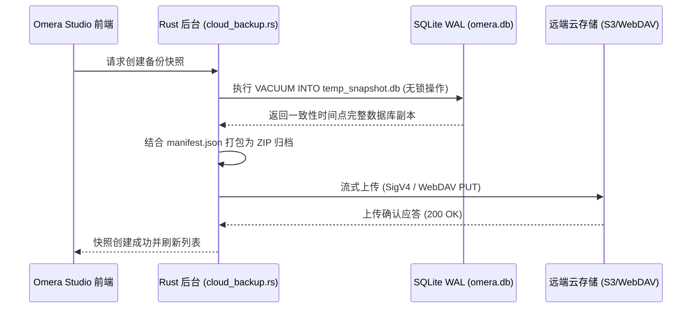

# 云端快照备份与增量同步

Omera 内置了专用的云端快照备份与差异增量同步引擎（`src-tauri/src/cloud_backup.rs` 与 `src-tauri/src/cloud_sync.rs`），无需依赖任何第三方繁琐的备份软件，即可实现数据库的秒级热备份以及远程媒体资产的增量镜像。

---

## 1. 支持的云存储服务商与协议

在**首选项设置 > 云端备份与快照**中配置你的远端存储终结点：

| 服务商类型 | 支持协议与服务 | 技术实现要点 |
| :--- | :--- | :--- |
| **S3 兼容对象存储** | AWS S3、Cloudflare R2、MinIO、Backblaze B2、Wasabi | 纯 Rust 原生实现的 AWS Signature Version 4 (SigV4) 鉴权协议，HMAC-SHA256 签名传输。 |
| **WebDAV 私有云** | Nextcloud、ownCloud、群晖 (Synology DiskStation)、威联通 (QNAP NAS) | 基于 HTTPS 加密通道的工业标准 HTTP Basic Authentication。 |
| **本地目录 / 网络存储** | 本地从盘、高速外接移动 SSD、局域网 SMB / NFS 共享文件夹 | 纯本地/局域网文件系统极速零开销 I/O，无额外协议封装损耗。 |

---

## 2. SQLite 在线热快照机制 (`cloud_backup_create_snapshot`)

Omera 基于 SQLite 原生的 `VACUUM INTO` 核心指令实现高可靠一致性快照：

### 快照可靠性保障：
- **无锁非阻塞 (Non-Locking)**：利用 SQLite WAL 的底层并发特性，备份期间数据库无需停机，你可以继续顺畅看图、评分或跑图入库，丝毫不受干扰。
- **自动本地回滚防线**：在执行从云端快照还原操作时，Omera 会在覆盖前自动在本地留存一份回滚备份（`omera.db.rollback`），即使遭遇意外断网或文件损坏，亦可一键安全回退。

---

## 3. 增量媒体镜像与差异同步 (`cloud_sync.rs`)

如果说快照负责守护数据库的元数据骨骼，那么**差异同步 (Delta Sync)** 则是为你数以万计的原始图片与视频原图保驾护航。

### 同步引擎核心能力：
- **两档差异比对策略 (Change Detection)**：
  - *快速指纹*：比对本地文件大小与远端 HTTP ETag（速度最快，适合带宽有限的网络环境）。
  - *严格校验*：执行流式 SHA-256 哈希计算，百分之百保证文件二进制级别的完全一致性。
- **令牌桶带宽限速 (Token-Bucket Rate Limiter)**：支持在设置中设定上传速率上限（KB/s），确保后台云同步不会挤占工作室的正常工作带宽。
- **并发工作线程调节**：可按硬件与网络条件配置 1 到 8 个并发上传传输线程。
- **演练模式 (Dry-Run)**：在真正发起上传前，仅比对差异并输出待上传、待跳过或待删除的文件清单报告，不产生实际写入。
- **实时进度推送**：向前端高频广播包含已传字节数、实时传输速度、剩余预估时间（ETA）与当前文件名的进度事件。
