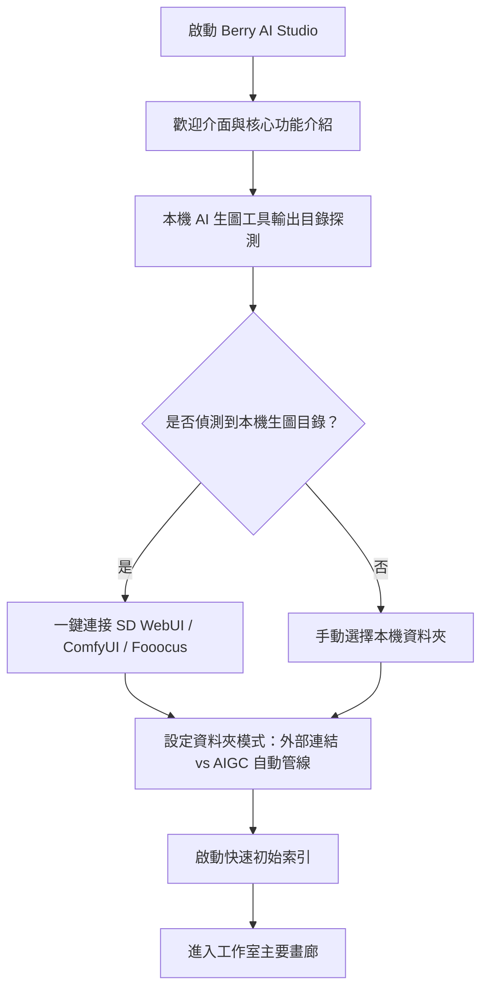

# 安裝與首次啟動

本指南詳細說明 **Berry AI Studio** 的系統需求、支援平台、安裝步驟以及首次啟動歡迎設定精靈流程。

---

## 1. 系統需求

Berry AI Studio 採用基於 **Tauri v2**、**Rust** 與 **SQLite WAL** 的極致效能原生架構。它在一般規格硬體上即可流暢運作，同時能充分發揮多核心工作站與 NVMe 儲存裝置的極致潛力，輕鬆駕馭超大圖庫（50,000 至 500,000+ 檔案）。

### 最低硬體需求
- **CPU**：雙核心 x86_64 或 ARM64 處理器（Intel Core i3 / AMD Ryzen 3 / Apple M1 或更佳）。
- **RAM**：4 GB 記憶體（若需執行本機 CLIP/WD14 ONNX 模型，建議 8 GB 以上）。
- **硬碟空間**：約 150 MB 應用程式安裝空間；另需保留縮圖快取空間（預設 2 GB LRU 快取配額，可自訂）與媒體儲存空間。
- **螢幕解析度**：最低 1280 × 800 視窗解析度（具備彈性自適應版面，最低支援至 960 × 640）。

### 支援的作業系統
| 作業系統 | 支援版本 | 架構 | 安裝套件類型 |
| :--- | :--- | :--- | :--- |
| **Windows** | Windows 10 (1809+) 與 Windows 11 | `x86_64` (64-bit) | 標準安裝程式 (`.exe`)、免安裝可攜版 (`.zip`) |
| **macOS** | macOS 12 (Monterey) 或更新版本 | `aarch64` (Apple Silicon M1/M2/M3/M4) 與 `x86_64` (Intel) | 磁碟映像檔 (`.dmg`)、通用二進位檔 (Universal) |
| **Linux** | Ubuntu 20.04+、Debian 11+、Fedora 36+、Arch Linux | `x86_64` | AppImage (`.AppImage`)、Debian 套件 (`.deb`) |

---

## 2. 安裝步驟

請從 [GitHub Releases 發布頁面](https://github.com/BerryUIKI/Berry-AI-Studio/releases) 或 [官方網站](https://berryuiki.github.io/Berry-AI-Studio/) 下載官方正式組建安裝包。

### Windows
1. **標準安裝程式 (`Berry-AI-Studio_Windows_x64.exe`)**：
   - 按兩下安裝執行檔。
   - 依照安裝精靈指示選擇安裝位置，並建立桌面與開始功能表捷徑。
   - 安裝程式會自動配置捷徑並註冊通訊協定處理程式。
2. **免安裝可攜版 ZIP (`Berry-AI-Studio_Windows_x64.zip`)**：
   - 將 `.zip` 壓縮檔解壓縮至偏好的磁碟路徑（例如外接高速 NVMe SSD 或隨身硬碟）。
   - 直接執行 `berry-ai-studio.exe`，無需管理者權限。

### macOS
1. 下載對應您處理器架構的磁碟映像檔：
   - Apple Silicon (M1/M2/M3/M4)：`Berry-AI-Studio_macOS_aarch64.dmg`
   - Intel Core：`Berry-AI-Studio_macOS_x64.dmg`
2. 開啟 `.dmg` 檔案，將 **Berry AI Studio** 拖曳至 `/Applications` 應用程式資料夾中。
3. 軟體套件已通過 Apple Gatekeeper 簽章與公證。首次啟動時，直接從「應用程式」或「Spotlight」開啟即可。

### Linux
1. **AppImage (`Berry-AI-Studio_Linux_x64.AppImage`)**：
   - 賦予二進位執行檔可執行權限：
     ```bash
     chmod +x Berry-AI-Studio_Linux_x64.AppImage
     ./Berry-AI-Studio_Linux_x64.AppImage
     ```
2. **Debian / Ubuntu (`Berry-AI-Studio_Linux_x64.deb`)**：
   - 透過 `dpkg` 或 `apt` 進行安裝：
     ```bash
     sudo dpkg -i Berry-AI-Studio_Linux_x64.deb
     sudo apt-get install -f # 自動解析並安裝可能缺失的 webkit2gtk 相依套件
     ```

---

## 3. 首次啟動歡迎設定精靈

當您首次啟動 Berry AI Studio 時，互動式 **歡迎設定精靈** (`OnboardingModal.vue`) 將自動彈出，引導您完成初始配置。



### 精靈設定步驟：
1. **歡迎畫面**：介紹 3 大核心支柱：
   - 極速本機索引與無損生成元數據擷取解析。
   - 智慧型撲克牌折疊連拍堆疊與雙圖並排深度比對。
   - 100% 離線隱私保障，零遙測數據收集。
2. **本機 AI 生成工具自動探測**：
   - Berry 會自動掃描電腦所有磁碟代號（如 `C:\`、`D:\`、`/home/`）中常見的輸出目錄：
     - **AUTOMATIC1111 / SD.Next** (`outputs/txt2img-images`, `outputs/img2img-images`)
     - **ComfyUI** (`ComfyUI/output`)
     - **Fooocus** (`Fooocus/outputs`)
     - **InvokeAI** (`invokeai/outputs`)
   - 探測成功後，您可一鍵將其連接為 **AIGC 自動管線** 或 **外部連結與監聽** 資料夾。
3. **選擇儲存模式**：
   - 決定 Berry 如何與您的實體檔案互動（詳細說明請參閱 [資料夾模式與匯入](../02-library-management/folder-modes-and-import.md)）。
4. **完成初始化**：
   - Berry 將以 Write-Ahead Logging (WAL) 模式初始化本機 SQLite 資料庫 (`berry.db`)，在背景啟動目錄掃描，並引導您直接進入主要畫廊畫布。

---

## 4. 應用程式儲存與資料目錄

Berry AI Studio 會將所有圖庫索引、快取與設定檔案儲存在使用者個人設定檔路徑中：

- **Windows**：`%APPDATA%\com.berryuiki.berryaistudio\`（例如 `C:\Users\<User>\AppData\Roaming\com.berryuiki.berryaistudio\`）
- **macOS**：`~/Library/Application Support/com.berryuiki.berryaistudio/`
- **Linux**：`~/.config/com.berryuiki.berryaistudio/`

### 目錄結構與內容：
- `berry.db`：核心 SQLite 資料庫，儲存所有圖片元數據、評分、標籤、相簿與堆疊關聯。
- `berry.db-wal` 與 `berry.db-shm`：SQLite WAL 預寫日誌與共享記憶體暫存檔案。
- `config.json`：軟體偏好設定（主題、畫廊檢視模式、縮圖規格、生圖工具 API 端點等）。
- `thumbnails/`：高效 WebP 縮圖快取目錄，檔案格式為 `{file_id}_{mtime}_{edge}.webp`。
- `models/`：本機 ONNX AI 模型權重存放目錄，用於 CLIP、SigLIP 語意搜尋與 WD14 Danbooru 自動標籤。

> [!TIP]
> 您可以隨時在 **偏好設定 > 資料儲存與關於** 中，點擊專屬的「打開所在目錄」按鈕，快速開啟上述系統資料夾。
