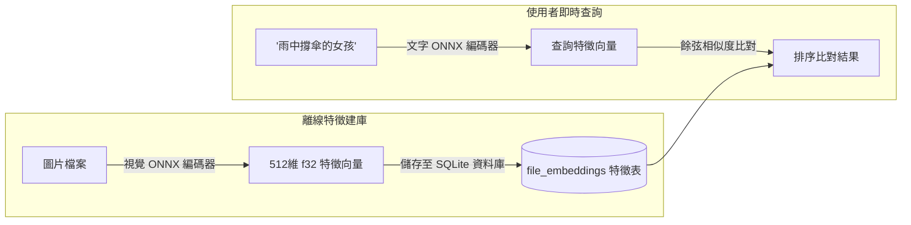

# AI 語意搜尋與自動標籤

Omera 內建全本機運行的 AI 推論引擎，提供由本機模型驅動的**自然語言文字語意搜圖** (`omera-clip`) 以及 **動漫風格/美學自動標籤器** (`omera-tagger`)。所有類神經網路模型皆透過 ONNX Runtime 在您的本機硬體上 100% 離線執行，絕不會將任何圖片或提示詞外傳至雲端 API。

---

## 1. 自然語言文字語意搜圖 (`omera-clip`)

傳統的元數據搜尋要求輸入的關鍵字必須一字不差地出現在當初的生成提示詞中。而 **語意搜尋** 允許您使用自然語言描述畫面的視覺意境（例如：*「雨夜中撐著雨傘的少女」*），Omera 便能根據視覺概念的抽象相似性找出相符的作品。

### 配置語意搜尋索引：
1. 點擊 **工具 > CLIP 語意檢索模型與索引...** 開啟管理視窗 (`ClipManagerModal.vue`)。
2. Omera 會自動掃描本機 `models/clip/` 目錄中相容的 CLIP / SigLIP ONNX 模型（視覺編碼器、文字編碼器與 tokenizer 分詞器）。
3. 點擊 **「開始為未索引圖片建庫」**：Omera 會在背景透過多執行緒計算正規化特徵向量，並批次寫入 SQLite 資料庫的 `file_embeddings` 數據表。
4. **執行自然語言檢索**：
   - 在頂部搜尋列點擊大腦圖示 (`🧠`) 切換至 **語意搜尋模式**。
   - 輸入任意自然語言描述詞組並按下 `Enter`。
   - 畫廊卡片將依照視覺餘弦相似度從高到低優雅排列呈現。

---

## 2. 視覺相似度檢索（圖搜圖）

您可以直接以圖庫中的現有畫作為基準，探索視覺風格或構圖相近的其他作品：
1. 在任意圖片上按滑鼠右鍵，或在右側檢查器中點擊 **「尋找相似圖片」**。
2. Omera 會即時讀取該圖片快取的特徵向量，透過餘弦距離檢索最相鄰的近鄰圖片。
3. 畫廊畫布自動切換至 **相似圖片檢索視圖**，直觀標註相似度百分比徽章（例如 `96% 相似`），並附帶可即時拖曳調節的相似度門檻滑桿（0% 至 95%）。

---

## 3. WD14 / Danbooru 動漫 AI 自動標籤器 (`omera-tagger`)

若您的圖庫中收藏有來自 NovelAI、動漫 Checkpoint（如 Animagine、NAI、Anything 系列）的作品或無標籤插畫，Omera 內建的 **WD14 自動標籤器** (`AutoTagModal.vue`) 能為作品精準預測並自動附加 Danbooru 社群標籤。

### 支援的模型架構：
- **SwinV2**、**ConvNeXt**、**ViT** 與 **MOAT** ONNX 模型。
- 搭配標準的 `selected_tags.csv` 分類字典檔。

### 標籤分類體系與置信度閾值：
標籤器會將預測結果細分為三大類別：
1. **一般標籤 (General Tags)**（例如 `1girl`、`blue eyes`、`looking at viewer`、`cherry blossoms`）。
   - 預設置信度閾值：`0.35`（可自訂調校）。
2. **角色標籤 (Character Tags)**（自動辨識特定動漫/遊戲知名角色）。
   - 預設置信度閾值：`0.85`（採用較高閾值以防止角色誤判）。
3. **分級標籤 (Rating Tags)**（`general` 安全、`sensitive` 敏感、`questionable` 存疑、`explicit` 露骨）。
   - 用於自動識別並為圖片標註敏感內容旗標 (`is_nsfw`)。

### 批次自動標籤處理：
- 在畫廊中多選圖片後，點擊浮動批次操作列上的 **「自動標籤」**，設定置信度門檻與標籤數量上限，Omera 即會在背景逐一推論，為圖庫作品自動加上標準化的色彩標籤。
