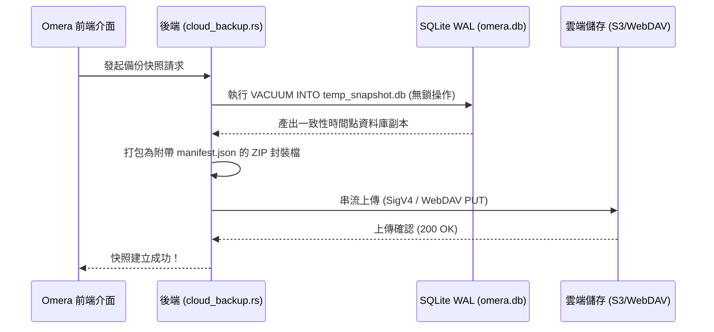

# 雲端快照備份與差異同步

Omera 配備原生的雲端備份與增量差異同步引擎（`src-tauri/src/cloud_backup.rs` 與 `src-tauri/src/cloud_sync.rs`），無需依賴第三方工具，即可實現資料庫一致性快照備份與遠端媒體檔案增量鏡像同步。

---

## 1. 支援的儲存服務類型

您可以在 **偏好設定 > 雲端備份與快照** 中設定遠端儲存端點：

| 服務類型 | 支援協定 / 服務商 | 技術特色 |
| :--- | :--- | :--- |
| **AWS S3 / 相容物件儲存** | AWS S3、Cloudflare R2、MinIO、Backblaze B2、Wasabi | 純 Rust 原生實作 AWS Signature Version 4 (SigV4) 憑證驗證與 HMAC-SHA256 簽署。 |
| **WebDAV** | Nextcloud、ownCloud、Synology DiskStation、QNAP NAS | 基於 HTTPS 的標準 HTTP Basic 認證協定。 |
| **本地 / 網路共享路徑** | 本機磁碟、外接 USB SSD、區域網路 SMB / NFS 共享目錄 | 直接執行極速檔案系統 I/O，完全無網路協定封裝額外損耗。 |

---

## 2. 熱 SQLite 快照備份機制 (`cloud_backup_create_snapshot`)

Omera 運用 SQLite 原生的 `VACUUM INTO` 指令來實現無縫熱備份：

### 快照核心保障：
- **全程無鎖 (Non-Locking)**：呼叫 SQLite 線上清空真空 API，備份期間您可以照常檢索、評分、批次標記或生成入庫，完全不受干擾。
- **復原防護機制 (Rollback Safety)**：當從遠端快照執行還原時，Omera 會在覆蓋前自動於本地建立安全還原備份 (`omera.db.rollback`)，從容抵禦網路異常中斷或下載校驗失敗風險。

---

## 3. 增量媒體映像與差異同步 (`cloud_sync.rs`)

如果說資料庫快照保障了元數據結構的安全，**差異同步 (Delta Sync)** 則負責在本地磁碟與遠端雲端/NAS 之間同步龐大的高解析度實體圖片與影片檔案。

### 同步引擎功能：
- **差異比對策略**：
  - *快速指紋 (Fast Fingerprint)*：快速比對本地檔案大小與遠端 HTTP ETag 標記（速度最快，適合日常連線）。
  - *嚴格校驗 (Strict Checksum)*：以串流方式即時計算 SHA-256 完整雜湊值，保障資料流位元組級精準一致。
- **權杖桶頻寬限速 (Bandwidth Limiter)**：可自訂上傳頻寬上限（KB/s，輸入 0 為不限速），避免背景同步傳輸佔滿工作室對外網路。
- **並發執行緒調節**：支援配置 1 至 8 個平行並行傳輸執行緒。
- **演練模式 (Dry-Run Mode)**：僅比對差異並產出變動報表，不執行實際的檔案傳輸或刪除。
- **即時進度監控**：持續發送即時進度事件，包含已同步檔案數、傳輸速率、預估剩餘時間 (ETA) 與當前傳輸檔案路徑。
